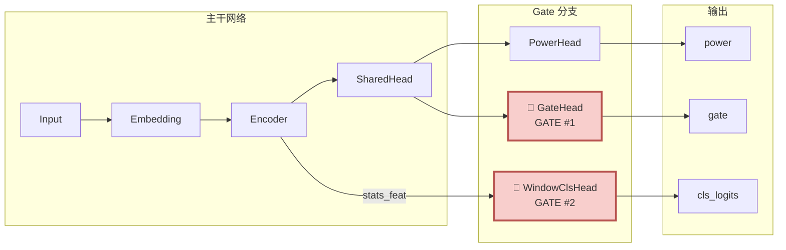
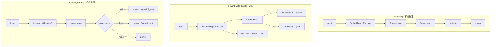
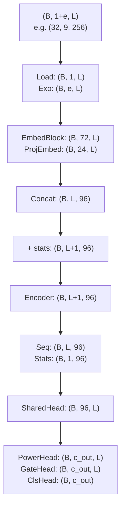

# NILMFormer 网络架构 - Mermaid 图

## 完整网络流程图

```mermaid
flowchart TB
    subgraph Input["输入层"]
        IN[/"输入 (B, 1+e, L)"/]
        IN --> SPLIT{分离}
        SPLIT --> LC["Load Curve<br/>(B, 1, L)"]
        SPLIT --> EX["Exogenous<br/>(B, e, L)"]
    end

    subgraph Norm["归一化"]
        LC --> INSTNORM["Instance Norm<br/>计算 mean, std"]
        INSTNORM --> |"mean,std"| PROJSTATS1["ProjStats1<br/>Linear(2→96)"]
    end

    subgraph Embedding["Embedding 模块"]
        INSTNORM --> EMBED
        subgraph EMBED["EmbedBlock (DilatedBlock)"]
            RES1["ResUnit dilation=1<br/>Conv1d→GELU→BN"]
            RES2["ResUnit dilation=2<br/>Conv1d→GELU→BN"]
            RES3["ResUnit dilation=4<br/>Conv1d→GELU→BN"]
            RES4["ResUnit dilation=8<br/>Conv1d→GELU→BN"]
            RES1 --> RES2 --> RES3 --> RES4
        end
        EX --> PROJEMBED["ProjEmbedding<br/>Conv1d(e→24)"]
    end

    subgraph Concat["特征拼接"]
        RES4 --> |"(B,72,L)"| CAT1["Concatenate"]
        PROJEMBED --> |"(B,24,L)"| CAT1
        CAT1 --> |"(B,L,96)"| CAT2["Concat stats_token"]
        PROJSTATS1 --> |"(B,1,96)"| CAT2
    end

    subgraph Encoder["Transformer Encoder"]
        CAT2 --> |"(B,L+1,96)"| ENC
        subgraph ENC["EncoderBlock x3"]
            direction TB
            LN1["LayerNorm1"]
            ATTN["DiagonallyMasked<br/>SelfAttention<br/>(8 heads)"]
            RES_A["+ Residual"]
            LN2["LayerNorm2"]
            PFFN["PFFN<br/>96→384→96"]
            RES_B["+ Dropout + Residual"]
            LN1 --> ATTN --> RES_A --> LN2 --> PFFN --> RES_B
        end
        ENC --> FINALLN["Final LayerNorm"]
    end

    subgraph Split2["特征分离"]
        FINALLN --> SPLIT2{分离}
        SPLIT2 --> |"x[:,:-1,:]"| SEQFEAT["序列特征<br/>(B, L, 96)"]
        SPLIT2 --> |"x[:,-1:,:]"| STATSFEAT["stats_feat<br/>(B, 1, 96)"]
    end

    subgraph Heads["输出头"]
        SEQFEAT --> |"permute"| SHARED["SharedHead<br/>Conv1d(96→96, k=3)"]
        SHARED --> SPLIT3{分支}

        SPLIT3 --> POWER["PowerHead<br/>Conv1d(96→c_out, k=1)"]
        SPLIT3 --> GATE["🔶 GateHead<br/>(GATE #1)<br/>Conv1d(96→c_out, k=1)"]

        STATSFEAT --> CLS["🔷 WindowClsHead<br/>(GATE #2)<br/>Linear(96→c_out)"]
        STATSFEAT -.-> PROJSTATS2["ProjStats2<br/>Linear(96→2)<br/>(可选)"]
    end

    subgraph Activation["激活层与门控"]
        POWER --> SOFTPLUS["clamp + softplus<br/>(raw_power)"]
        GATE --> SIGMOID["sigmoid(gate * scale)<br/>(gate_prob)"]
        PROJSTATS2 -.-> |"mean,std调整"| SOFTPLUS
        SOFTPLUS --> MUL["power * (gate_floor +<br/>(1-gate_floor)*gate_prob)"]
        SIGMOID --> MUL
    end

    subgraph Output["多任务输出"]
        MUL --> OUT_P["gated_power<br/>(B, c_out, L)<br/>门控后的功率预测"]
        GATE --> OUT_G["gate_logits<br/>(B, c_out, L)<br/>开关门控logits"]
        CLS --> OUT_C["cls_logits<br/>(B, c_out)<br/>窗口分类"]
    end

    style GATE fill:#f8cecc,stroke:#b85450,stroke-width:3px
    style CLS fill:#f8cecc,stroke:#b85450,stroke-width:3px
    style OUT_G fill:#f8cecc,stroke:#b85450
    style OUT_C fill:#f8cecc,stroke:#b85450
```

## 简化版 - Gate 位置示意图

## Gate 详细信息表

| Gate 名称 | 类型 | 位置 | 输入维度 | 输出维度 | 作用 |
|-----------|------|------|----------|----------|------|
| **GateHead** | Conv1d(k=1) | SharedHead 之后 | (B, 96, L) | (B, c_out, L) | 逐时间步功率门控 |
| **WindowClsHead** | Linear | Encoder stats_feat 之后 | (B, 96) | (B, c_out) | 窗口级设备分类 |

## Gate 软门控公式说明

在训练和推理中，网络不会直接输出最终功率，而是先得到原始功率 `power` 和门控 logits `gate`，然后通过软门控组合成最终的门控功率 `gated_power`。

- 步骤 1：对功率分支做非线性

  - 从 PowerHead 得到 `power_raw`
  - 经过截断和 softplus 得到非负功率
    - `power = softplus(clamp(power_raw, min=-10))`

- 步骤 2：对 gate 分支做 sigmoid

  - 从 GateHead 得到 `gate_logits`
  - 先乘以缩放系数，再过 sigmoid 得到开关概率
    - `gate_prob = sigmoid(gate_logits * gate_soft_scale)`

- 步骤 3：构造带地板的软门控权重

  - 为了避免门控过低导致输出完全熄灭，引入 `gate_floor ∈ [0,1]`
  - 对每个时间步、每个设备的门控权重为
    - `w = gate_floor + (1 - gate_floor) * gate_prob`

- 步骤 4：应用门控得到最终功率输出

  - 对应时间步的最终功率为
    - `gated_power = power * w`

总结：

- `gate_prob` 越接近 0，`w` 越接近 `gate_floor`，输出被强烈压制但不会完全归零；
- `gate_prob` 越接近 1，`w` 趋近于 1，输出接近原始功率；
- 这种设计让 gate 同时具备“抑制长时间假阳性”和“保留一定能量以防完全塌缩”的能力。

## 三种前向传播模式

## 维度变化流程

