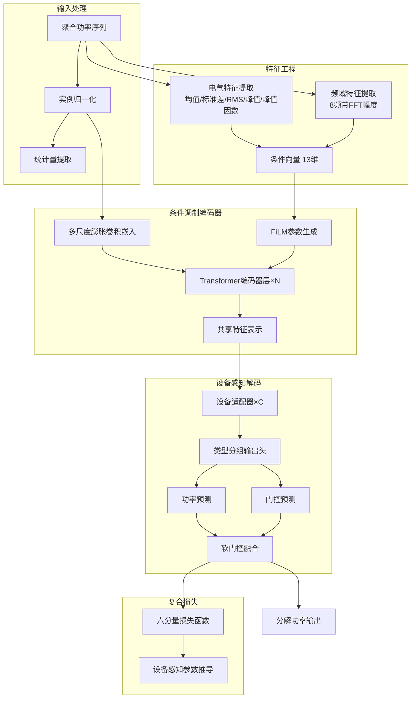
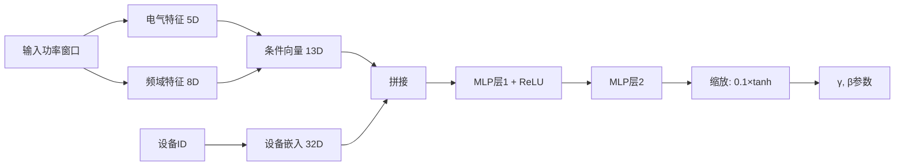
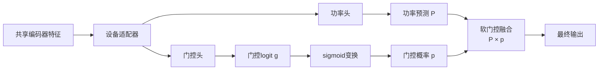
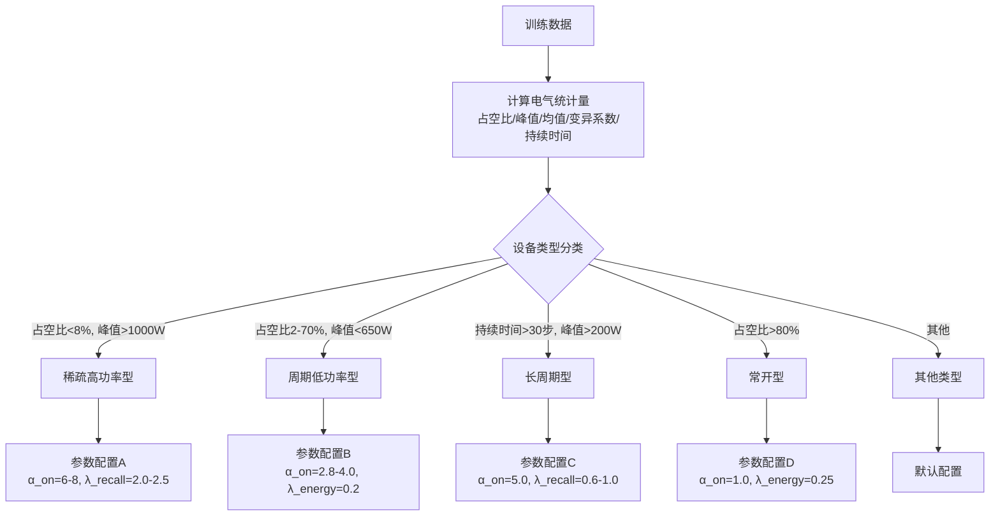

# 第三章 基于条件特征调制的非侵入式负荷分解方法

## 3.1 问题定义与分析

### 3.1.1 NILM问题的形式化定义

非侵入式负荷监测（NILM）的核心目标是从建筑物总电表采集的聚合功率信号中分解出各个电器设备的独立功耗曲线。设$x(t)$表示在时刻$t$测得的聚合功率，$y_c(t)$表示第$c$个目标设备在时刻$t$的实际功耗，则NILM任务可形式化为寻找映射函数$f$，使得：

$$\hat{y}_c(t) = f_c(x(t-w:t+w)), \quad c = 1, 2, \ldots, C$$

其中$w$表示上下文窗口半径，$C$为目标设备总数。理想情况下，分解后的各设备功率之和应等于聚合功率减去未建模负荷：$\sum_{c=1}^{C} y_c(t) + \epsilon(t) = x(t)$，其中$\epsilon(t)$表示未知负荷和测量噪声。

从机器学习角度，NILM可视为一个序列到序列的回归问题，但其复杂性远超一般回归任务。首先，目标变量呈现极端的稀疏性——对于典型家用电器，设备处于开启状态的时间占比（占空比）通常低于20%，某些设备（如电热水壶）甚至低于5%。其次，不同设备的功率量级差异悬殊，从数瓦的待机功率到数千瓦的高功率设备，跨越三个数量级。第三，多设备同时运行时功率信号相互叠加，形成复杂的组合模式，分解难度随设备数量呈指数增长。

### 3.1.2 现有方法的局限性分析

自Hart于1992年开创性地提出NILM概念以来，该领域经历了从基于规则的组合优化方法到统计学习方法，再到近年深度学习方法的技术演进。以NILMformer为代表的基于Transformer的方法在公开数据集上取得了领先的性能，但深入分析发现，现有方法在以下四个方面存在系统性局限：

**梯度冲突与优化困境**。当使用单一模型同时分解多种设备时，不同设备对共享参数的梯度更新方向往往相互矛盾。这一现象的根本原因在于各设备的统计特性和学习难度存在本质差异：冰箱呈现周期性压缩机启停模式，微波炉表现为短时高功率脉冲，洗衣机则具有复杂的多阶段运行周期。实验观察表明，在联合训练过程中，占空比高的设备（如冰箱）在训练数据中占据主导地位，其梯度信号会淹没稀疏设备的学习信号。原始NILMformer采用完全共享参数的设计，缺乏针对设备差异的处理机制，这一局限性在多设备场景下尤为突出。

**领域知识的缺失**。电气工程领域积累了丰富的负荷特性分析方法，如功率因数、谐波分析、瞬态特征等。这些基于物理原理的特征已被证明对设备识别具有强判别力。然而，现有端到端深度学习方法试图完全从原始功率数据中自动学习特征表示，既增加了模型的学习负担，也难以保证能够发现这些关键的物理特性。以峰值因数（Crest Factor）为例，它是区分电阻性负载与电容性负载的重要指标，但纯数据驱动的方法需要大量样本才能隐式学习到这一特性，在训练数据有限时表现不佳。

**损失函数的单一性**。标准回归损失函数（MSE、MAE）对所有时间点和所有设备一视同仁，未能考虑NILM任务的特殊性。对于占空比仅5%的设备，95%的训练信号来自设备关闭时段，模型容易学会输出接近零的预测以最小化整体损失——即"预测塌缩"现象。此外，不同设备对检测精度和功率估计精度有不同需求：稀疏高功率设备（如电热水壶）更关注检测是否启动，而持续运行设备（如冰箱）更关注功率波动的准确追踪。统一的损失函数无法满足这种差异化需求。

**边界效应的影响**。基于滑动窗口的序列到序列方法在窗口边界处面临上下文信息不完整的问题。窗口起始和结束位置的时间点缺乏足够的上下文，预测质量受损。这一问题在使用自注意力机制时尤为明显，因为边界处token的有效注意力范围受限。

### 3.1.3 研究目标与技术路线

针对上述问题，本文提出CondiNILMformer方法，核心思想是将领域知识与深度学习有机融合，通过条件特征调制机制实现对不同设备类型的自适应处理。具体而言，本文的技术路线包含三个相互关联的创新点：

第一，提出基于FiLM（Feature-wise Linear Modulation）的条件调制框架，将手工提取的电气特征和频域特征作为条件信息注入神经网络。这一设计使模型能够根据当前输入的电气特性动态调整其处理方式，实现领域知识与数据驱动学习的桥接。

第二，设计设备感知的多层级架构，包括设备特定适配器、类型分组输出头和软门控融合机制。这一架构在共享表示学习与设备差异化处理之间取得平衡，缓解多设备联合训练中的梯度冲突。

第三，构建六分量复合损失函数，每个分量针对NILM任务的特定需求设计，并根据设备电气统计特征自动推导权重参数，实现"不同设备、不同优化策略"的精细化训练。

图3.1展示了本文方法的整体技术框架：

## 3.2 条件特征调制框架

### 3.2.1 条件调制的理论基础

条件调制（Conditional Modulation）是一种将外部条件信息注入神经网络的技术范式。其核心思想是通过条件信号动态调整网络的内部参数或激活值，使网络行为能够适应不同的输入情境。这一思想在条件生成模型、视觉问答、风格迁移等领域已有成功应用。

本文采用的FiLM（Feature-wise Linear Modulation）机制最初由Perez等人在视觉问答任务中提出。FiLM通过学习的仿射变换参数对特征进行逐通道调制：

$$\text{FiLM}(\mathbf{h}; \gamma, \beta) = (1 + \gamma) \odot \mathbf{h} + \beta$$

其中$\mathbf{h}$为待调制的特征向量，$\gamma$和$\beta$分别为从条件信息派生的缩放和平移参数，$\odot$表示逐元素乘法。$(1+\gamma)$而非$\gamma$的设计确保当$\gamma=0$时变换退化为恒等映射加偏置，有利于训练初期的稳定性。

将FiLM引入NILM任务的动机在于：不同类型的设备需要不同的特征处理策略。例如，当输入窗口呈现高峰值因数时，模型应增强对短时脉冲的敏感度以检测电热水壶或微波炉；当输入呈现周期性波动时，模型应关注周期特征以追踪冰箱的压缩机启停。通过将这些电气特征作为条件信息，FiLM机制使模型能够根据输入特性自适应地调整其处理行为。

### 3.2.2 电气特征设计

本文从输入功率窗口中提取五个电气特征，它们从不同角度刻画负荷的时域统计特性：

**平均功率**反映窗口内的整体功率水平，是最基本的负荷特征。不同设备类型的平均功率范围差异显著，可作为设备类型的初步指示。

**功率标准差**度量功率偏离均值的程度，反映负荷的变化幅度。高标准差通常对应设备的状态转换（启动或关闭），低标准差则表示稳态运行或设备关闭。

**均方根功率（RMS）**在电气工程中常用于表征交流信号的有效值。对于功率信号，RMS与平均值的关系反映了功率分布的形态特征。

**峰值功率**捕获窗口内的最大功率瞬时值，对于识别高功率设备的启动事件尤为关键。即使设备仅短暂启动，峰值特征也能有效捕获。

**峰值因数**定义为峰值功率与RMS功率的比值，是本文引入的关键判别特征。峰值因数反映功率波形的"尖锐程度"：纯阻性负载（如电热水器稳态）的峰值因数接近1，而脉冲型负载（如微波炉启动）的峰值因数显著大于1。这一特征在电气工程负荷分析中已有数十年的应用历史，其有效性是经过实践验证的。

### 3.2.3 频域特征设计

频域特征通过傅里叶变换将功率信号从时域转换到频域，刻画信号的频率成分和周期性模式。本文的频域特征提取采用分频带能量汇聚策略：

首先对输入功率窗口去均值以消除直流分量的影响，然后进行快速傅里叶变换（FFT）获取幅度谱。将正频率部分等分为8个频带，计算每个频带的平均幅度作为特征。低频分量（前几个频带）反映整体功率趋势和长周期模式；中频分量对应设备的周期性运行模式（如冰箱压缩机的启停周期）；高频分量包含快速波动和噪声信息。

频带数量的选择（8个）基于经验确定：过少的频带无法提供足够的频率分辨率来区分不同设备的周期特性，过多的频带则增加特征维度并可能引入噪声。8个频带在信息量与简洁性之间取得了良好平衡。

### 3.2.4 设备感知的参数生成

本文的关键创新在于为每个目标设备生成独立的FiLM参数，而非使用共享参数。这一设计的理论依据是：不同设备对相同条件特征应有不同的响应方式。例如，高峰值因数对于检测电热水壶是强正向信号，但对于检测冰箱则关系不大。

为实现设备感知的条件调制，本文引入可学习的设备嵌入向量。每个目标设备对应一个嵌入向量，与条件特征拼接后通过多层感知机（MLP）映射到FiLM参数。这样，每个设备获得基于相同条件特征但经过设备特定变换的调制参数，实现了条件信息与设备身份的交互。

FiLM参数的生成过程可概括为：
1. 计算条件特征向量（13维：5维电气特征 + 8维频域特征）
2. 查询目标设备的嵌入向量
3. 拼接条件特征与设备嵌入
4. 通过MLP映射得到$\gamma$和$\beta$参数
5. 对参数进行缩放（限制在[-0.1, 0.1]范围）以确保训练稳定性

## 3.3 多设备自适应架构

### 3.3.1 设计原则

CondiNILMformer的架构设计遵循"共享与专用相结合"的原则。完全共享参数的设计（如原始NILMformer）虽然参数效率高，但无法适应不同设备的差异化需求；完全独立的多模型方案虽然灵活，但参数冗余且难以利用设备间的知识迁移。本文采用层次化的参数共享策略：

- **底层共享**：特征嵌入层和Transformer编码器在所有设备间共享，学习通用的功率序列表示
- **中层半共享**：设备适配器为每个设备提供轻量级特征调整，在共享表示基础上引入设备特异性
- **顶层分组**：输出头按设备类型分组，同类设备共享参数以利用相似性，不同类型设备独立参数以适应差异

这种层次化设计为多设备NILM任务提供了良好的归纳偏置，平衡了参数效率与任务性能。

### 3.3.2 实例归一化与统计令牌

不同建筑物的总功率水平存在显著差异，这主要源于建筑面积、居住人数、设备配置等因素。如果直接将原始功率值输入模型，模型需要同时学习绝对数值和相对变化模式，增加了学习难度。

本文在模型输入处引入实例归一化（Instance Normalization），对每个输入序列独立计算均值和标准差进行标准化。归一化后的特征分布被标准化为零均值、单位方差，模型可以专注于学习功率的相对变化模式。

然而，归一化丢弃了原始功率的幅度信息，而这些信息对某些设备识别可能有用。为保留幅度信息，本文将归一化前的统计量（均值和标准差）投影为"统计令牌"，与序列特征拼接后共同参与Transformer处理。这样，模型既能处理归一化后的相对特征，又能通过统计令牌获取原始幅度信息。

### 3.3.3 多尺度膨胀卷积嵌入

原始NILMformer使用简单的线性投影将输入序列映射到高维特征空间。这种逐点操作无法捕捉局部的时序结构（如功率的上升沿、下降沿、稳态段）。本文采用多尺度膨胀卷积作为特征嵌入器，通过不同膨胀率的卷积核捕捉多时间尺度的模式。

膨胀卷积的优势在于：通过在卷积核元素间插入空洞，可以在不增加参数量的情况下扩大感受野。本文使用四层膨胀卷积，膨胀率依次为{1, 2, 4, 8}，总体有效感受野覆盖约60个时间步，足以捕捉大多数设备的状态转换周期。每层卷积后使用残差连接，确保梯度能够有效传播。

### 3.3.4 对角线掩码自注意力

标准自注意力允许每个位置关注序列中的所有位置，包括自身。在NILM任务中，本文认为每个时间点的表示应由其上下文决定，而非简单的自复制。如果允许自关注，模型可能倾向于走"捷径"——直接复制自身值而非学习有意义的上下文关系。

为此，本文对自注意力矩阵应用对角线掩码，将对角线元素设为负无穷大，经softmax后这些位置的注意力权重为零，有效禁止了自关注。这一设计强制模型通过聚合周围上下文信息来构建每个位置的表示。

### 3.3.5 设备特定适配器

在共享编码器之后，本文为每个目标设备引入轻量级适配器模块。适配器采用瓶颈结构：先将特征维度减半，经过非线性激活后再恢复原始维度。这种设计使适配器的参数量仅为编码器层的一小部分。

适配器的输出通过小权重的残差连接与共享特征相加。残差权重设为0.1，确保适配器仅进行轻微调整而非大幅改变特征。在训练初期，适配器输出接近零，模型主要依赖共享特征；随着训练进行，适配器逐渐学习设备特定的调整。

### 3.3.6 类型分组的多头输出

对于输出层，本文提出类型分组机制。首先根据设备的电气特性将其划分为若干类型（如稀疏高功率型、周期型、长周期型），然后同一类型的设备共享输出头，不同类型使用独立输出头。

这种设计的依据是：同类设备在电气特性上具有相似性，可以共享参数以利用这种相似性并提高参数效率；不同类型设备在本质特性上存在差异，需要独立参数以适应这些差异。

每个输出头产生两个预测：功率回归值和门控logit。功率回归值预测设备开启时的功率消耗，门控logit预测设备开启的概率。

### 3.3.7 软门控融合机制

本文将功率预测分解为两个子任务：功率估计（设备开启时消耗多少功率）和状态检测（设备是否开启）。传统方法将两者混为一谈，使用单一输出同时表示状态和功率，在稀疏设备上容易导致预测塌缩。

软门控机制将两个子任务的预测进行融合：最终功率等于功率预测值乘以门控概率。门控概率通过参数化的sigmoid变换得到，包含三个可调参数：

- **门控下界（floor）**：门控概率的最小值，防止门控完全关闭输出，确保即使门控判断设备关闭时仍保留少量输出
- **缩放因子（scale）**：控制sigmoid斜率，影响门控决策的锐度
- **偏置（bias）**：控制默认的开关倾向

不同类型设备配置不同的门控参数：稀疏高功率设备设置负偏置使门控默认关闭，仅在强开启信号下才打开；周期性设备设置中等缩放使门控平滑过渡。

## 3.4 设备感知损失函数

### 3.4.1 标准损失函数的局限性

标准回归损失函数在NILM任务中面临三个核心问题。第一，类别不平衡：对于占空比5%的设备，95%的训练信号来自关闭时段，模型倾向于输出低值以最小化损失。第二，误差类型未区分：漏检（将开启预测为关闭）比误报（将关闭预测为开启）在应用中通常更严重，但标准损失对两者一视同仁。第三，设备差异被忽视：不同设备的优化重点不同，统一损失无法适应。

### 3.4.2 六分量复合损失设计

本文设计的复合损失函数包含六个分量，每个分量针对特定的优化目标：

$$\mathcal{L} = w_1\mathcal{L}_{main} + w_2\mathcal{L}_{global} + w_3\mathcal{L}_{recall} + w_4\mathcal{L}_{off} + w_5\mathcal{L}_{power} + w_6\mathcal{L}_{energy}$$

**主回归损失**改进了标准回归损失，分别对开启和关闭时段加权计算。通过软阈值函数（sigmoid）区分开启/关闭状态，避免硬阈值带来的梯度不连续。开启时段和关闭时段分别计算平均损失后加权组合，权重$\alpha_{on}$和$\alpha_{off}$控制两者的相对重要性。

**全局稳定损失**是不加权的标准回归损失，提供基线监督信号。在训练初期，当软权重计算可能不稳定时，全局稳定损失确保模型有稳定的学习方向。

**ON召回损失**专门惩罚对开启时段的低估，防止预测塌缩。当预测值低于目标值的一定比例时激活惩罚，确保模型不会系统性地低估开启功率。

**OFF误报损失**专门惩罚关闭时段的高估，控制误报率。当关闭时段的预测超过设定容限时产生惩罚。

**ON功率精度损失**使用相对误差而非绝对误差，直接优化NDE（Normalized Disaggregation Error）指标，对不同功率水平的设备具有一致的精度要求。

**能量回归损失**约束窗口内的总能量预测，确保分解功率的总和准确，直接优化总能量守恒目标。

### 3.4.3 设备感知的参数自动推导

六分量损失函数包含多个可调参数。为避免繁琐的手动调参，本文提出基于设备电气统计特征自动推导参数的方法。

首先，从训练数据计算每个设备的电气统计量：占空比、峰值功率、平均开启功率、功率变异系数、平均事件持续时间。然后，根据这些统计量将设备自动分类为若干类型（如稀疏高功率、周期低功率、长周期等）。最后，每种设备类型对应一组预定义的损失参数，并根据实际占空比进行微调。

这种自动推导机制使损失函数能够根据设备的实际特性进行自适应配置：
- 稀疏高功率设备：高$\alpha_{on}$（强调检测）、高召回惩罚（防止漏检）
- 周期性设备：平衡的$\alpha_{on}/\alpha_{off}$、高能量惩罚（强调追踪）
- 长周期设备：高召回惩罚（防止漏检长事件）

## 3.5 训练策略

### 3.5.1 多层级防塌缩机制

预测塌缩是多设备NILM训练中的常见问题。本文设计了三层级的防塌缩保护：

**损失函数层级**：ON召回损失和ON功率精度损失从损失函数内部提供防塌缩信号，对开启时段的低估施加惩罚。

**辅助惩罚层级**：在主损失之外添加辅助反塌缩惩罚项，包括能量比率惩罚（要求预测能量至少达到目标的一定比例）和通道级惩罚（对每个设备单独检查预测比率）。

**动态衰减层级**：反塌缩惩罚在训练初期提供保护，但后期可能过度约束精细化学习。本文采用动态衰减策略，惩罚强度随训练进行逐渐降低，最终消失。

### 3.5.2 序列中心监督

基于滑动窗口的方法在窗口边界处存在上下文不完整问题。本文采用序列中心监督策略，仅在窗口中心区域（约63%）计算损失，边界区域被忽略。这确保用于训练的预测都有足够的上下文信息。推理时通过滑动窗口重叠获取完整预测。

### 3.5.3 学习率调度

本文采用余弦退火预热调度策略。预热阶段（前3个epoch）学习率从零线性增加，使模型参数从随机初始化平稳过渡；之后学习率按余弦曲线平滑下降，相比阶梯式下降更有利于稳定收敛。

## 3.6 与原始NILMformer的对比

表3.1总结了CondiNILMformer与原始NILMformer的主要技术差异：

| 方面 | 原始NILMformer | CondiNILMformer |
|------|---------------|-----------------|
| 特征嵌入 | 线性投影 | 多尺度膨胀卷积 |
| 条件信息 | 无 | 电气特征(5D)+频域特征(8D)+FiLM调制 |
| 设备处理 | 完全共享输出头 | 设备适配器+类型分组头 |
| 输出形式 | 单一功率预测 | 功率预测+门控概率+软融合 |
| 损失函数 | MSE/SmoothL1 | 六分量复合损失+设备感知参数 |
| 防塌缩机制 | 无 | 多层级惩罚+动态衰减 |
| 边界处理 | 全序列监督 | 中心区域监督 |

## 3.7 本章小结

本章提出了CondiNILMformer方法，一种基于条件特征调制的非侵入式负荷分解方法。核心贡献包括三个方面：

第一，通过FiLM条件调制机制实现了领域知识与深度学习的有机融合。电气特征和频域特征提供了经过数十年实践验证的负荷判别信息，FiLM机制将这些信息优雅地注入神经网络，提高了模型的样本效率和可解释性。

第二，通过多层级自适应架构解决了多设备联合训练中的梯度冲突问题。设备适配器、类型分组输出头和软门控机制在共享表示学习与设备差异化处理之间取得平衡，使单一模型能够同时处理特性迥异的多种设备。

第三，通过设备感知的复合损失函数解决了NILM任务中的类别不平衡和预测塌缩问题。六分量损失函数针对不同优化目标设计，参数根据设备统计特征自动推导，实现了精细化的差异化训练。

这些创新相互配合，形成了完整的方法论体系。下一章将详细介绍系统的具体实现和实验设置。
