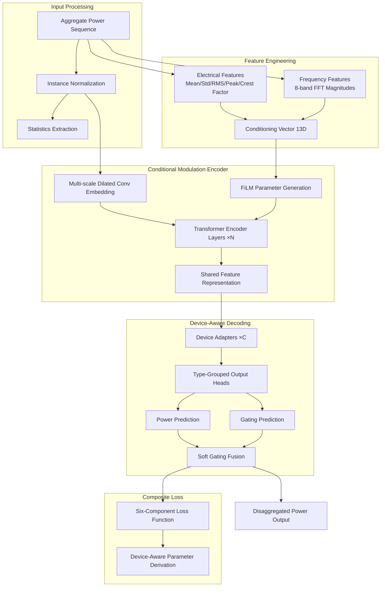
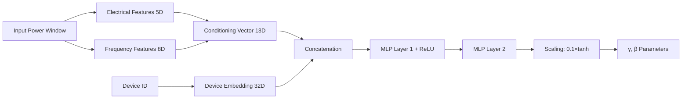
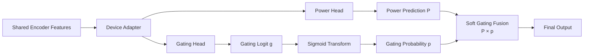
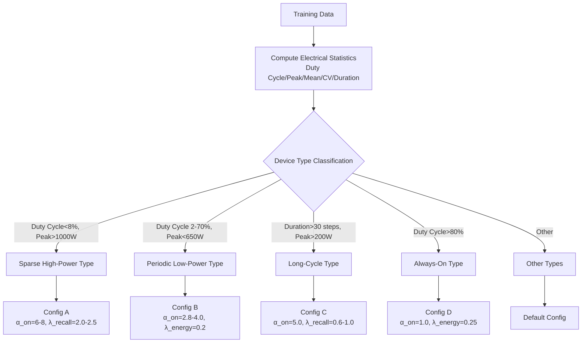

# Chapter 3: A Conditional Feature Modulation Approach for Non-Intrusive Load Monitoring

## 3.1 Problem Definition and Analysis

### 3.1.1 Formal Definition of the NILM Problem

The fundamental objective of Non-Intrusive Load Monitoring (NILM) is to disaggregate the individual power consumption curves of appliances from the aggregate power signal measured at a building's main electrical panel. Let $x(t)$ denote the aggregate power measured at time $t$, and $y_c(t)$ represent the actual power consumption of the $c$-th target appliance at time $t$. The NILM task can be formalized as finding a mapping function $f$ such that:

$$\hat{y}_c(t) = f_c(x(t-w:t+w)), \quad c = 1, 2, \ldots, C$$

where $w$ represents the context window radius and $C$ is the total number of target appliances. Ideally, the sum of disaggregated power should equal the aggregate power minus unmodeled loads: $\sum_{c=1}^{C} y_c(t) + \epsilon(t) = x(t)$, where $\epsilon(t)$ represents unknown loads and measurement noise.

From a machine learning perspective, NILM can be viewed as a sequence-to-sequence regression problem, yet its complexity far exceeds typical regression tasks. First, target variables exhibit extreme sparsity—for typical household appliances, the duty cycle (proportion of time in the ON state) is usually below 20%, with some appliances (such as kettles) falling below 5%. Second, power magnitudes differ drastically across appliances, spanning three orders of magnitude from single-digit standby power to kilowatt-level high-power devices. Third, when multiple appliances operate simultaneously, their power signals superimpose to form complex combinatorial patterns, with disaggregation difficulty growing exponentially with the number of appliances.

### 3.1.2 Limitations of Existing Methods

Since Hart's pioneering introduction of the NILM concept in 1992, the field has evolved from rule-based combinatorial optimization methods to statistical learning approaches, and more recently to deep learning methods. Transformer-based methods represented by NILMformer have achieved state-of-the-art performance on public benchmarks. However, deeper analysis reveals that existing methods suffer from systematic limitations in four aspects:

**Gradient Conflict and Optimization Dilemma.** When using a single model to simultaneously disaggregate multiple appliances, different appliances often produce contradictory gradient updates for shared parameters. The root cause lies in the essential differences in statistical characteristics and learning difficulty across appliances: refrigerators exhibit periodic compressor cycling patterns, microwaves display short high-power pulses, and washing machines undergo complex multi-stage operating cycles. Empirical observations indicate that during joint training, high duty-cycle appliances (such as refrigerators) dominate the training data, and their gradient signals overwhelm the learning signals of sparse appliances. The original NILMformer employs a fully shared parameter design lacking mechanisms for handling appliance diversity, a limitation particularly pronounced in multi-appliance scenarios.

**Absence of Domain Knowledge.** The electrical engineering field has accumulated rich methods for load characteristic analysis, including power factor, harmonic analysis, and transient features. These physics-based features have been proven highly discriminative for appliance identification. However, existing end-to-end deep learning methods attempt to learn feature representations entirely from raw power data, both increasing the model's learning burden and failing to guarantee discovery of these critical physical properties. Taking crest factor as an example, it is an important indicator for distinguishing resistive loads from capacitive loads, yet purely data-driven methods require substantial samples to implicitly learn this property, performing poorly when training data is limited.

**Uniformity of Loss Functions.** Standard regression loss functions (MSE, MAE) treat all time points and all appliances equally, failing to account for the specificity of NILM tasks. For appliances with only 5% duty cycle, 95% of training signals come from OFF periods, causing models to learn to output near-zero predictions to minimize overall loss—the "prediction collapse" phenomenon. Furthermore, different appliances have different requirements for detection accuracy versus power estimation accuracy: sparse high-power appliances (such as kettles) prioritize detecting whether activation occurred, while continuously running appliances (such as refrigerators) prioritize accurate tracking of power fluctuations. A uniform loss function cannot satisfy such differentiated requirements.

**Boundary Effects.** Sliding window-based sequence-to-sequence methods face incomplete context information at window boundaries. Time points at the start and end of windows lack sufficient context, degrading prediction quality. This problem is particularly evident when using self-attention mechanisms because the effective attention range of boundary tokens is constrained.

### 3.1.3 Research Objectives and Technical Approach

Addressing the above problems, this thesis proposes CondiNILMformer, whose core idea is to organically integrate domain knowledge with deep learning through conditional feature modulation mechanisms that enable adaptive processing for different appliance types. Specifically, the technical approach encompasses three interrelated innovations:

First, we propose a conditional modulation framework based on FiLM (Feature-wise Linear Modulation), injecting hand-crafted electrical features and frequency-domain features as conditioning information into the neural network. This design enables the model to dynamically adjust its processing behavior based on the electrical characteristics of the current input, bridging domain knowledge with data-driven learning.

Second, we design a device-aware multi-level architecture comprising device-specific adapters, type-grouped output heads, and soft gating fusion mechanisms. This architecture balances shared representation learning with device-differentiated processing, mitigating gradient conflicts in multi-appliance joint training.

Third, we construct a six-component composite loss function, each component designed for specific NILM requirements, with weight parameters automatically derived from appliance electrical statistics to achieve fine-grained "different appliances, different optimization strategies" training.

Figure 3.1 illustrates the overall technical framework of the proposed method:

## 3.2 Conditional Feature Modulation Framework

### 3.2.1 Theoretical Foundation of Conditional Modulation

Conditional modulation is a technical paradigm for injecting external conditioning information into neural networks. The core idea is to dynamically adjust the network's internal parameters or activation values through conditioning signals, enabling network behavior to adapt to different input contexts. This concept has achieved success in conditional generative models, visual question answering, and style transfer.

The FiLM (Feature-wise Linear Modulation) mechanism adopted in this thesis was originally proposed by Perez et al. for visual question answering tasks. FiLM modulates features channel-wise through learned affine transformation parameters:

$$\text{FiLM}(\mathbf{h}; \gamma, \beta) = (1 + \gamma) \odot \mathbf{h} + \beta$$

where $\mathbf{h}$ is the feature vector to be modulated, $\gamma$ and $\beta$ are scaling and shifting parameters derived from conditioning information, and $\odot$ denotes element-wise multiplication. The $(1+\gamma)$ design rather than plain $\gamma$ ensures that when $\gamma=0$, the transformation degenerates to identity mapping plus bias, facilitating training stability in early stages.

The motivation for introducing FiLM into NILM tasks is that different appliance types require different feature processing strategies. For instance, when the input window exhibits high crest factor, the model should enhance sensitivity to short pulses for detecting kettles or microwaves; when the input shows periodic fluctuation, the model should focus on periodic features to track refrigerator compressor cycling. By using these electrical features as conditioning information, the FiLM mechanism enables the model to adaptively adjust its processing behavior based on input characteristics.

### 3.2.2 Electrical Feature Design

This thesis extracts five electrical features from the input power window, characterizing the temporal statistical properties of loads from different perspectives:

**Mean power** reflects the overall power level within the window and is the most fundamental load feature. Different appliance types have significantly different mean power ranges, serving as a preliminary indication of appliance type.

**Power standard deviation** measures the degree of power deviation from the mean, reflecting the magnitude of load variation. High standard deviation typically corresponds to appliance state transitions (startup or shutdown), while low standard deviation indicates steady-state operation or appliance OFF state.

**Root mean square (RMS) power** is commonly used in electrical engineering to characterize the effective value of AC signals. For power signals, the relationship between RMS and mean reflects the morphological characteristics of power distribution.

**Peak power** captures the maximum instantaneous power within the window, particularly critical for identifying startup events of high-power appliances. Even if an appliance activates only briefly, the peak feature can effectively capture it.

**Crest factor**, defined as the ratio of peak power to RMS power, is a key discriminative feature introduced in this thesis. Crest factor reflects the "sharpness" of the power waveform: purely resistive loads (such as steady-state water heaters) have crest factors approaching 1, while pulse-type loads (such as microwave startup) have crest factors significantly greater than 1. This feature has decades of application history in electrical engineering load analysis, with proven effectiveness.

### 3.2.3 Frequency-Domain Feature Design

Frequency-domain features transform power signals from the time domain to the frequency domain through Fourier transform, characterizing the frequency components and periodic patterns of signals. The frequency-domain feature extraction in this thesis employs a band-aggregated energy strategy:

First, the input power window is mean-subtracted to eliminate DC component influence, then Fast Fourier Transform (FFT) is applied to obtain the magnitude spectrum. The positive frequency portion is divided equally into 8 frequency bands, with the mean magnitude of each band computed as features. Low-frequency components (first few bands) reflect overall power trends and long-period patterns; mid-frequency components correspond to periodic operating patterns of appliances (such as refrigerator compressor cycling); high-frequency components contain rapid fluctuations and noise information.

The choice of 8 frequency bands is empirically determined: too few bands provide insufficient frequency resolution to distinguish different appliances' periodic characteristics, while too many bands increase feature dimensionality and may introduce noise. Eight bands achieve a good balance between information content and simplicity.

### 3.2.4 Device-Aware Parameter Generation

A key innovation in this thesis is generating independent FiLM parameters for each target appliance rather than using shared parameters. The theoretical basis is that different appliances should respond differently to the same conditioning features. For example, high crest factor is a strong positive signal for detecting kettles but largely irrelevant for detecting refrigerators.

To achieve device-aware conditional modulation, this thesis introduces learnable device embedding vectors. Each target appliance corresponds to an embedding vector that is concatenated with conditioning features and mapped through a multi-layer perceptron (MLP) to FiLM parameters. Thus, each appliance obtains modulation parameters based on the same conditioning features but through device-specific transformations, achieving interaction between conditioning information and device identity.

The FiLM parameter generation process can be summarized as:
1. Compute conditioning feature vector (13D: 5D electrical + 8D frequency)
2. Query target appliance's embedding vector
3. Concatenate conditioning features and device embedding
4. Map through MLP to obtain raw $\gamma$ and $\beta$ parameters
5. Scale parameters (constrained to [-0.1, 0.1] range) to ensure training stability

## 3.3 Multi-Device Adaptive Architecture

### 3.3.1 Design Principles

The architecture design of CondiNILMformer follows the principle of "combining shared and specialized components." A fully shared parameter design (as in the original NILMformer), while parameter-efficient, cannot adapt to the differentiated requirements of different appliances; a fully independent multi-model approach, while flexible, suffers from parameter redundancy and difficulty leveraging knowledge transfer between appliances. This thesis adopts a hierarchical parameter sharing strategy:

- **Lower layers shared**: Feature embedding layers and Transformer encoders are shared across all appliances, learning universal power sequence representations
- **Middle layers semi-shared**: Device adapters provide lightweight feature adjustment for each appliance, introducing device specificity on top of shared representations
- **Upper layers grouped**: Output heads are grouped by appliance type, with same-type appliances sharing parameters to leverage similarity, while different types use independent parameters to accommodate differences

This hierarchical design provides good inductive bias for multi-device NILM tasks, balancing parameter efficiency and task performance.

### 3.3.2 Instance Normalization and Statistics Token

Different buildings exhibit significantly different total power levels, primarily due to building area, number of occupants, and appliance configurations. If raw power values are directly input to the model, the model must simultaneously learn absolute values and relative variation patterns, increasing learning difficulty.

This thesis introduces instance normalization at the model input, independently computing mean and standard deviation for each input sequence for standardization. After normalization, the feature distribution is standardized to zero mean and unit variance, allowing the model to focus on learning relative power variation patterns.

However, normalization discards the amplitude information of raw power, which may be useful for identifying certain appliances. To preserve amplitude information, this thesis projects the pre-normalization statistics (mean and standard deviation) as "statistics tokens," concatenated with sequence features to jointly participate in Transformer processing. Thus, the model can both process normalized relative features and access original amplitude information through statistics tokens.

### 3.3.3 Multi-Scale Dilated Convolution Embedding

The original NILMformer uses simple linear projection to map input sequences to high-dimensional feature space. This point-wise operation cannot capture local temporal structure (such as power rising edges, falling edges, and steady-state segments). This thesis adopts multi-scale dilated convolution as the feature embedder, capturing multi-time-scale patterns through convolution kernels with different dilation rates.

The advantage of dilated convolution is that by inserting holes between convolution kernel elements, it can expand the receptive field without increasing parameter count. This thesis uses four dilated convolution layers with dilation rates {1, 2, 4, 8}, with an overall effective receptive field covering approximately 60 time steps, sufficient to capture most appliances' state transition periods. Each convolution layer uses residual connections to ensure effective gradient propagation.

### 3.3.4 Diagonally-Masked Self-Attention

Standard self-attention allows each position to attend to all positions in the sequence, including itself. In NILM tasks, this thesis argues that each time point's representation should be determined by its context rather than simple self-copying. If self-attention is allowed, the model may tend to take a "shortcut"—directly copying its own value rather than learning meaningful contextual relationships.

To address this, this thesis applies a diagonal mask to the self-attention matrix, setting diagonal elements to negative infinity, which results in zero attention weights at these positions after softmax, effectively prohibiting self-attention. This design forces the model to construct each position's representation by aggregating surrounding contextual information.

### 3.3.5 Device-Specific Adapters

After the shared encoder, this thesis introduces lightweight adapter modules for each target appliance. Adapters use a bottleneck structure: first reducing feature dimensionality by half, applying nonlinear activation, then restoring to original dimensionality. This design makes adapter parameter count only a small fraction of encoder layers.

Adapter output is added to shared features through a small-weight residual connection. The residual weight is set to 0.1, ensuring adapters only make minor adjustments rather than drastically altering features. In early training, adapter outputs are near zero, with the model primarily relying on shared features; as training progresses, adapters gradually learn device-specific adjustments.

### 3.3.6 Type-Grouped Multi-Head Output

For the output layer, this thesis proposes a type-grouping mechanism. First, appliances are categorized into several types based on their electrical characteristics (such as sparse high-power, periodic, long-cycle), then same-type appliances share output heads while different types use independent output heads.

The rationale for this design is that same-type appliances share electrical characteristic similarities, enabling parameter sharing to leverage this similarity and improve parameter efficiency; different-type appliances have essential characteristic differences, requiring independent parameters to accommodate these differences.

Each output head produces two predictions: power regression value and gating logit. The power regression value predicts power consumption when the appliance is ON, while the gating logit predicts the probability of the appliance being ON.

### 3.3.7 Soft Gating Fusion Mechanism

This thesis decomposes power prediction into two subtasks: power estimation (how much power the appliance consumes when ON) and state detection (whether the appliance is ON). Traditional methods conflate both, using a single output to simultaneously represent state and power, easily leading to prediction collapse on sparse appliances.

The soft gating mechanism fuses predictions from both subtasks: final power equals power prediction multiplied by gating probability. The gating probability is obtained through a parameterized sigmoid transformation with three adjustable parameters:

- **Gate floor**: Minimum gating probability, preventing the gate from completely shutting off output, ensuring some output remains even when the gate determines the appliance is OFF
- **Scale factor**: Controls sigmoid slope, affecting the sharpness of gating decisions
- **Bias**: Controls default ON/OFF tendency

Different appliance types are configured with different gating parameters: sparse high-power appliances have negative bias making the gate default to closed, opening only with strong ON signals; periodic appliances have moderate scaling for smooth gating transitions.

## 3.4 Device-Aware Loss Function

### 3.4.1 Limitations of Standard Loss Functions

Standard regression loss functions face three core problems in NILM tasks. First, class imbalance: for appliances with 5% duty cycle, 95% of training signals come from OFF periods, causing models to tend toward outputting low values to minimize loss. Second, error types are not distinguished: missed detection (predicting ON as OFF) is typically more severe than false alarm (predicting OFF as ON) in applications, yet standard losses treat both equally. Third, device differences are ignored: different appliances have different optimization priorities, and a uniform loss cannot adapt.

### 3.4.2 Six-Component Composite Loss Design

The composite loss function designed in this thesis comprises six components, each targeting specific optimization objectives:

$$\mathcal{L} = w_1\mathcal{L}_{main} + w_2\mathcal{L}_{global} + w_3\mathcal{L}_{recall} + w_4\mathcal{L}_{off} + w_5\mathcal{L}_{power} + w_6\mathcal{L}_{energy}$$

**Main regression loss** improves upon standard regression loss by separately weighting ON and OFF periods. A soft threshold function (sigmoid) distinguishes ON/OFF states, avoiding gradient discontinuity from hard thresholds. ON and OFF period average losses are computed separately then combined with weights, with $\alpha_{on}$ and $\alpha_{off}$ controlling their relative importance.

**Global stability loss** is an unweighted standard regression loss providing baseline supervision signals. During early training when soft weight computation may be unstable, global stability loss ensures the model has a stable learning direction.

**ON recall loss** specifically penalizes underestimation during ON periods, preventing prediction collapse. Penalty activates when predictions fall below a certain proportion of target values, ensuring the model does not systematically underestimate ON power.

**OFF false positive loss** specifically penalizes overestimation during OFF periods, controlling false alarm rate. Penalty is incurred when OFF period predictions exceed a set tolerance.

**ON power accuracy loss** uses relative error rather than absolute error, directly optimizing the NDE (Normalized Disaggregation Error) metric, providing consistent accuracy requirements for appliances at different power levels.

**Energy regression loss** constrains total energy prediction within the window, ensuring disaggregated power sums are accurate, directly optimizing the total energy conservation objective.

### 3.4.3 Device-Aware Automatic Parameter Derivation

The six-component loss function contains multiple tunable parameters. To avoid tedious manual tuning, this thesis proposes a method for automatically deriving parameters based on appliance electrical statistics.

First, electrical statistics are computed from training data for each appliance: duty cycle, peak power, mean ON power, power coefficient of variation, and mean event duration. Then, based on these statistics, appliances are automatically classified into several types (such as sparse high-power, periodic low-power, long-cycle). Finally, each appliance type corresponds to a set of predefined loss parameters, with fine-tuning based on actual duty cycle.

This automatic derivation mechanism enables the loss function to adaptively configure based on actual appliance characteristics:
- Sparse high-power appliances: High $\alpha_{on}$ (emphasizing detection), high recall penalty (preventing missed detection)
- Periodic appliances: Balanced $\alpha_{on}/\alpha_{off}$, high energy penalty (emphasizing tracking)
- Long-cycle appliances: High recall penalty (preventing missed detection of long events)

## 3.5 Training Strategy

### 3.5.1 Multi-Level Anti-Collapse Mechanism

Prediction collapse is a common problem in multi-device NILM training. This thesis designs three levels of anti-collapse protection:

**Loss function level**: ON recall loss and ON power accuracy loss provide anti-collapse signals from within the loss function, penalizing underestimation during ON periods.

**Auxiliary penalty level**: Auxiliary anti-collapse penalty terms are added beyond the main loss, including energy ratio penalty (requiring predicted energy to reach at least a certain proportion of target) and channel-level penalty (separately checking prediction ratios for each appliance).

**Dynamic decay level**: Anti-collapse penalties provide protection in early training but may over-constrain fine-grained learning later. This thesis adopts a dynamic decay strategy where penalty strength gradually decreases during training, eventually vanishing.

### 3.5.2 Sequence Center Supervision

Sliding window-based methods have context incompleteness problems at window boundaries. This thesis adopts a sequence center supervision strategy, computing loss only in the window's center region (approximately 63%), with boundary regions ignored. This ensures that predictions used for training all have sufficient contextual information. Complete predictions are obtained through overlapping sliding windows during inference.

### 3.5.3 Learning Rate Scheduling

This thesis adopts a cosine annealing warmup scheduling strategy. During the warmup phase (first 3 epochs), learning rate increases linearly from zero, allowing model parameters to transition smoothly from random initialization; afterward, learning rate decreases following a cosine curve, which is more conducive to stable convergence compared to step-wise decay.

## 3.6 Comparison with Original NILMformer

Table 3.1 summarizes the main technical differences between CondiNILMformer and the original NILMformer:

| Aspect | Original NILMformer | CondiNILMformer |
|--------|---------------------|-----------------|
| Feature Embedding | Linear projection | Multi-scale dilated convolution |
| Conditioning Information | None | Electrical features (5D) + Frequency features (8D) + FiLM modulation |
| Device Processing | Fully shared output head | Device adapters + Type-grouped heads |
| Output Form | Single power prediction | Power prediction + Gating probability + Soft fusion |
| Loss Function | MSE/SmoothL1 | Six-component composite loss + Device-aware parameters |
| Anti-Collapse Mechanism | None | Multi-level penalty + Dynamic decay |
| Boundary Handling | Full sequence supervision | Center region supervision |

## 3.7 Chapter Summary

This chapter proposes CondiNILMformer, a conditional feature modulation-based approach for non-intrusive load monitoring. The core contributions span three aspects:

First, the FiLM conditional modulation mechanism achieves organic integration of domain knowledge with deep learning. Electrical features and frequency-domain features provide load discriminative information validated through decades of practice, and the FiLM mechanism elegantly injects this information into neural networks, improving model sample efficiency and interpretability.

Second, the multi-level adaptive architecture addresses gradient conflict problems in multi-device joint training. Device adapters, type-grouped output heads, and soft gating mechanisms balance shared representation learning with device-differentiated processing, enabling a single model to simultaneously handle appliances with vastly different characteristics.

Third, the device-aware composite loss function addresses class imbalance and prediction collapse problems in NILM tasks. The six-component loss function is designed for different optimization objectives, with parameters automatically derived from appliance statistics, achieving fine-grained differentiated training.

These innovations work together to form a complete methodological system. The next chapter will detail the system's implementation and experimental setup.
