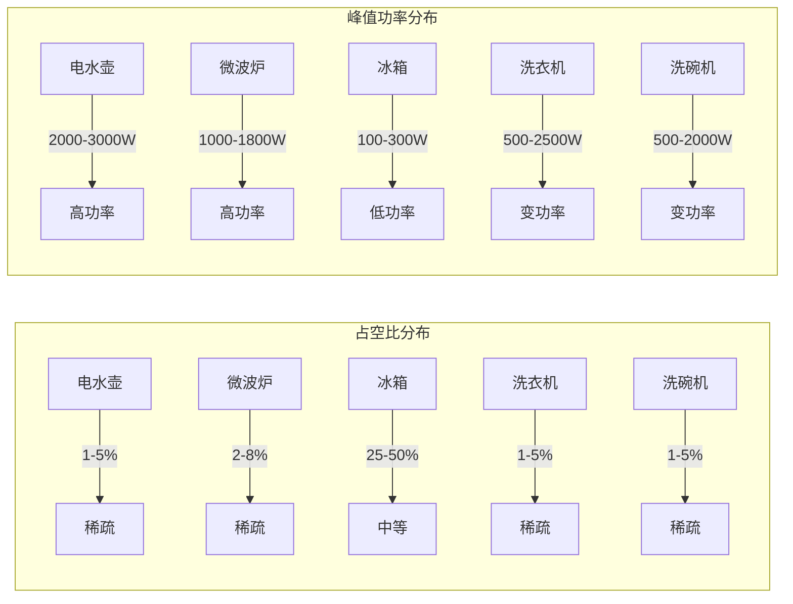
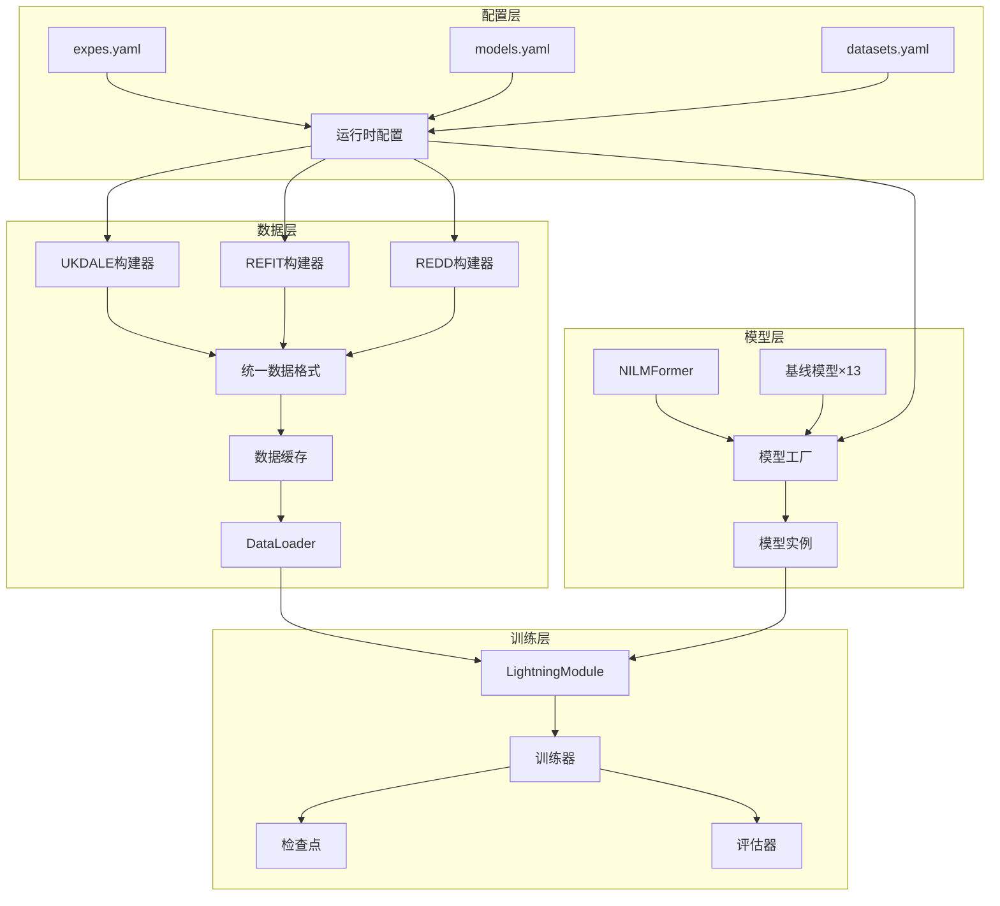
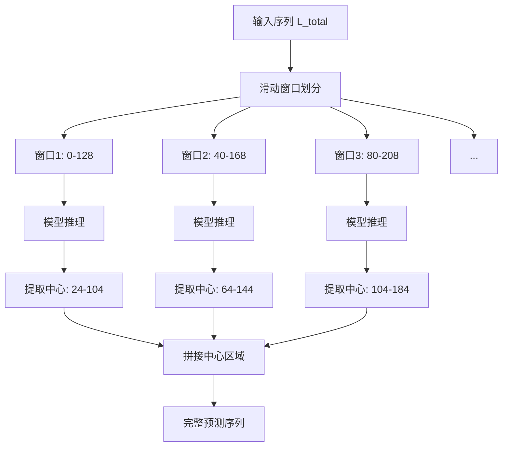

# 第四章 系统实现与实验设置

## 4.1 引言

前一章从理论层面阐述了CondiNILMformer的方法论设计，包括条件特征调制框架、多设备自适应架构和设备感知损失函数。本章将讨论如何将这些理论设计转化为可执行的软件系统，并介绍实验评估所需的数据集、评估指标和训练配置。

系统实现面临的核心挑战在于平衡灵活性与效率。一方面，NILM研究需要支持多数据集、多设备、多模型的灵活组合实验；另一方面，深度学习训练对计算效率有较高要求。本文采用模块化架构设计，将数据处理、模型定义、损失计算和训练流程解耦为独立组件，通过统一的配置系统进行协调。这种设计使研究者能够通过修改配置文件而非源代码来调整实验参数，同时确保了实验的可复现性。

本章组织如下：4.2节介绍实验所使用的三个公开NILM数据集；4.3节描述模型架构的具体实现；4.4节阐述训练与评估的配置细节；4.5节总结本章内容。

## 4.2 评估数据集

### 4.2.1 数据集概述

本文在三个广泛使用的公开NILM数据集上进行实验评估：UK-DALE、REFIT和REDD。这些数据集来自不同国家、不同时期的真实家庭用电记录，涵盖了多样化的用电模式和设备类型，能够全面检验方法的泛化能力。表4.1总结了三个数据集的基本特征。

| 数据集 | 国家 | 住宅数 | 采样率 | 记录时长 | 主要设备 |
|--------|------|--------|--------|----------|----------|
| UK-DALE | 英国 | 5 | 6秒 | 2-4年 | 电水壶、微波炉、冰箱、洗衣机、洗碗机 |
| REFIT | 英国 | 20 | 8秒 | 2年 | 冰箱、洗衣机、洗碗机、电视、电脑 |
| REDD | 美国 | 6 | 1秒/15秒 | 3-19天 | 冰箱、微波炉、洗衣机、洗碗机 |

### 4.2.2 UK-DALE数据集

UK Domestic Appliance-Level Electricity（UK-DALE）数据集由Kelly和Knottenbelt于2015年发布，是NILM领域最具影响力的基准数据集之一。该数据集记录了5个英国家庭的长期用电数据，总功率和各设备功率均以6秒采样率存储。

UK-DALE的显著特点是记录时间跨度长（部分住宅超过4年），覆盖了完整的季节变化和生活模式演变。这一特点使其成为评估模型长期泛化能力的理想选择。然而，数据集也存在局限性：住宅数量较少（仅5户），设备配置在不同住宅间差异较大，某些设备仅在部分住宅中可用。

本文选取五种具有代表性的目标设备进行实验：
- **电水壶（Kettle）**：典型的稀疏高功率设备，峰值功率2000-3000W，单次使用持续1-3分钟，占空比通常低于3%
- **微波炉（Microwave）**：短时高功率脉冲型设备，峰值功率1000-1500W，使用模式不规则
- **冰箱（Fridge）**：周期性运行设备，压缩机启停周期约15-30分钟，平均功率50-150W，占空比30-50%
- **洗衣机（Washing Machine）**：长周期多阶段设备，单次运行1-2小时，包含加热、洗涤、脱水等不同功率阶段
- **洗碗机（Dishwasher）**：与洗衣机类似的长周期设备，单次运行1-2小时

### 4.2.3 REFIT数据集

REFIT（Personalised Retrofit Decision Support Tools for UK Homes using Smart Home Technology）数据集包含20个英国家庭两年期间的用电记录。与UK-DALE相比，REFIT的住宅数量更多，提供了更丰富的家庭用电模式多样性。

REFIT的采样率为8秒，略低于UK-DALE的6秒，但对于分钟级分析已经足够。该数据集的标注相对规范，设备命名一致性较好，数据缺失率较低。然而，某些住宅的部分设备未安装子计量表，导致并非所有目标设备在所有住宅中都可用。

在REFIT上，本文主要评估冰箱、洗衣机和洗碗机三种设备，这些设备在大多数住宅中都有完整记录。

### 4.2.4 REDD数据集

Reference Energy Disaggregation Data Set（REDD）是NILM领域最早发布的公开数据集之一，由MIT于2011年发布。该数据集记录了6个美国家庭的用电数据，高频数据采样率高达15kHz，低频数据采样率为1秒或15秒。

REDD的独特价值在于其美国背景——与英国数据集相比，美国家庭的电器配置和用电习惯存在差异（如电压制式、常见电器类型）。在REDD上评估可以检验方法的跨地域泛化能力。

然而，REDD也存在明显局限：记录时长短（最长仅19天），数据质量参差不齐（某些住宅存在大量缺失），设备命名不一致（如"dish washer"与"dishwasher"混用）。本文在使用REDD时进行了设备名称标准化和数据质量筛选。

### 4.2.5 数据集统计特征

图4.1展示了三个数据集中主要设备的统计特征分布。可以观察到：

这些统计特征的差异正是本文提出设备感知方法的动机：电水壶和微波炉的稀疏高功率特性要求模型具备敏锐的事件检测能力；冰箱的周期性和中等占空比要求模型能够稳定追踪功率波动；洗衣机和洗碗机的长周期多阶段特性则要求模型能够捕捉复杂的功率演变模式。

## 4.3 模型实现

### 4.3.1 系统架构

CondiNILMformer系统采用分层模块化架构，主要包含四个层次：

**配置层**管理所有实验参数，采用YAML格式的层次化配置文件。主配置文件定义默认参数，模型配置文件和数据集配置文件提供特定覆盖，命令行参数允许运行时调整。配置系统使用OmegaConf库实现递归合并和类型验证。

**数据层**负责数据加载、预处理和批次构建。为每个数据集实现专用的数据构建器类，输出统一格式的四维张量。数据缓存机制通过唯一键值避免重复预处理，加速实验迭代。

**模型层**包含CondiNILMformer主模型和13种基线模型的PyTorch实现。模型工厂模式统一了实例化接口，支持动态参数注入。

**训练层**基于PyTorch Lightning框架，提供标准化的训练循环、检查点管理和分布式训练支持。

图4.2展示了系统的数据流和模块交互：

### 4.3.2 数据预处理实现

数据预处理流程将原始功率数据转换为模型可用的标准格式，主要包括以下步骤：

**重采样与对齐**：将不同采样率的原始数据统一到目标采样率（默认1分钟）。重采样采用均值聚合策略，在降低时间分辨率的同时保持功率的物理意义。时间对齐确保聚合功率与各设备功率在时间轴上严格对应。

**数据清洗**：处理缺失值、异常值和噪声。短期缺失（连续小于阈值）使用线性插值填补；长期缺失标记为无效区间并在窗口划分时排除。负值功率置零，极端高值截断至合理上限。低于传感器精度的微小波动（<5W）置零以消除噪声。

**状态标签计算**：根据设备特定的功率阈值和时间参数计算二值激活状态。初步阈值判定后，应用时间滤波抑制短于最小持续时间的伪激活和伪关闭。状态标签用于损失函数中的软加权和评估时的分类指标计算。

**滑动窗口划分**：将连续序列切分为固定长度窗口。支持非重叠模式（相邻窗口独立）和重叠模式（相邻窗口共享部分时间点）。窗口划分遵循三层级防泄漏策略：不同住宅的数据分配到不同的数据集划分；同一住宅内训练和验证数据之间保持时间间隔；仅使用通过质量检查的有效窗口。

**外生变量编码**：提取时间戳的周期性特征（小时、星期几、月份等），使用三角函数编码转换为连续向量。编码后的时间特征与功率序列拼接，作为模型的辅助输入。

### 4.3.3 模型架构实现

CondiNILMformer模型使用PyTorch框架实现，总参数量约2M，模型维度（d_model）默认176，编码器层数默认4层。以下描述各组件的实现要点。

**实例归一化**在前向传播开始时执行，计算当前批次每个样本的均值和标准差。统计量从计算图中分离（detach），避免参与梯度传播。标准差设置下界（默认0.01）以防除零。归一化后的统计量通过线性投影转换为统计令牌。

**多尺度膨胀卷积嵌入**由四个残差单元组成，膨胀率依次为{1, 2, 4, 8}。每个单元包含膨胀卷积、GELU激活和批归一化，采用"same"填充保持时间维度不变。残差连接使用1×1卷积进行通道匹配（当输入输出通道不同时）。

**条件特征计算**在每次前向传播时实时执行。电气特征（均值、标准差、RMS、峰值、峰值因数）通过PyTorch张量运算直接计算。频域特征使用torch.fft.rfft计算幅度谱，然后沿频率轴分8个频带汇聚。两类特征拼接形成13维条件向量。

**FiLM参数生成**使用两层MLP。设备嵌入通过nn.Embedding查询，与条件向量拼接后经过第一层MLP和ReLU激活，第二层MLP输出原始γ和β参数。参数经过0.1×tanh缩放后应用于特征。为支持多设备，编码器FiLM参数在所有目标设备上取平均后应用于共享编码器层。

**对角线掩码自注意力**在标准多头注意力基础上修改。注意力分数计算后，将对角线位置填充为-1e4（近似负无穷），softmax后对角线权重接近零。后续再显式将对角线置零确保数值稳定。

**设备适配器**为每个目标设备独立实例化。适配器包含两个1×1卷积层，中间维度为输入维度的一半。适配器输出乘以0.1的残差权重后与共享特征相加。

**类型分组输出头**根据配置的设备类型ID建立分组映射。同组设备共享输出头参数，每个输出头使用1×1卷积生成功率预测和门控logit。最终输出通过软门控公式融合。

### 4.3.4 损失函数实现

复合损失函数在自定义的Loss模块中实现，接收预测值、目标值和状态标签作为输入，返回加权总损失和各分量损失字典。

**软阈值权重计算**使用sigmoid函数：$p_{on} = \sigma((y - \tau) / T)$，其中τ为设备激活阈值，T为软化温度（默认0.1）。$p_{off} = 1 - p_{on}$。这种设计避免了硬阈值的梯度不连续问题。

**主回归损失**使用SmoothL1Loss（Huber损失）计算逐点误差，然后分别按$p_{on}$和$p_{off}$加权平均，最后按$\alpha_{on}$和$\alpha_{off}$组合。

**召回和误报损失**使用ReLU作为激活函数：召回损失为$\text{ReLU}(r \cdot y - \hat{y}) \cdot p_{on}$的加权平均，误报损失为$\text{ReLU}(\hat{y} - \delta) \cdot p_{off}$的加权平均。

**相对误差损失**在计算前对目标值添加小常数（1e-6）防止除零，并将结果裁剪到[0, 2]范围内防止极端值主导梯度。

**能量损失**计算窗口内预测和目标功率总和的相对误差，同样进行裁剪处理。

**设备感知参数**在训练开始前从数据统计量推导。参数推导函数根据占空比、峰值功率等特征将设备分类，然后查询预定义的参数表并根据实际统计量进行微调。

### 4.3.5 基线模型

为全面评估CondiNILMformer的性能，本文实现了13种基线模型，涵盖不同的架构范式：

**循环网络基线**：BiGRU和BiLSTM，使用双向循环单元建模序列依赖，是NILM领域的经典方法。

**卷积网络基线**：CNN1D、FCN、DResNet、DAResNet，使用一维卷积捕捉局部模式，DResNet和DAResNet引入残差连接和注意力机制。

**U-Net架构**：UNET_NILM，采用编码器-解码器结构和跳跃连接，适用于序列到序列任务。

**Transformer基线**：BERT4NILM（BERT架构应用于NILM）、Energformer（能量感知Transformer）、原始NILMformer。

**混合架构**：TSILNet（TCN+LSTM混合）、STNILM（专家混合模型）。

**扩散模型**：DiffNILM，基于扩散过程的生成式方法。

所有基线模型使用相同的数据预处理和评估流程，确保比较的公平性。

## 4.4 训练与评估配置

### 4.4.1 数据划分策略

实验采用住宅级别的数据划分，确保训练集和测试集来自不同住宅。具体划分如下：

**UK-DALE**：住宅1、2用于训练和验证，住宅5用于测试。这一划分遵循NILM领域的常见实践，住宅5的数据质量较好且包含所有目标设备。

**REFIT**：根据设备可用性动态选择住宅。对于每种设备，选择有完整记录的住宅子集，按8:2比例划分训练集和测试集。

**REDD**：由于数据记录时长短，采用更保守的划分。住宅1、2用于训练，住宅3用于测试。仅使用通过质量检查的设备数据。

在训练集内部，采用时间块划分策略创建验证集。训练数据和验证数据之间保持时间间隔，间隔大小等于窗口长度除以步长，确保验证数据与训练数据在时间上充分分离。

### 4.4.2 训练配置

表4.2列出了主要训练超参数及其默认值。这些参数经过在UK-DALE数据集上的超参数搜索确定，在其他数据集上通常无需调整即可获得良好性能。

| 参数 | 默认值 | 说明 |
|------|--------|------|
| 批次大小 | 128 | 训练批次中的样本数 |
| 训练轮数 | 25 | 最大训练epoch数 |
| 学习率 | 3×10⁻⁴ | AdamW优化器初始学习率 |
| 权重衰减 | 0.04 | L2正则化强度 |
| 预热轮数 | 3 | 学习率线性预热的epoch数 |
| 早停耐心 | 5 | 验证损失不改善的容忍epoch数 |
| 窗口长度 | 128 | 输入序列的时间步数 |
| 采样率 | 1分钟 | 重采样后的时间分辨率 |

**优化器配置**：使用AdamW优化器，β₁=0.9，β₂=0.999，ε=1e-8。AdamW将权重衰减与梯度更新解耦，在Transformer类模型上通常表现优于标准Adam。

**学习率调度**：采用余弦退火预热策略。前3个epoch线性预热，之后按余弦曲线从初始学习率衰减至1e-6。相比阶梯式衰减，余弦调度提供更平滑的学习率变化，有助于避免训练后期的振荡。

**混合精度训练**：在支持的GPU上启用FP16混合精度训练，前向传播使用半精度，梯度累积使用全精度。这一配置可将训练速度提升50%以上，同时减少约40%的显存占用。

**梯度裁剪**：设置梯度L2范数上限为1.0，防止梯度爆炸，是Transformer训练的标准配置。

### 4.4.3 评估指标

本文采用NILM领域通用的评估指标体系，涵盖回归精度和事件检测两个维度。

**回归指标**评估功率预测的准确性：

- **MAE（Mean Absolute Error）**：预测与真实功率的平均绝对误差，单位为瓦特，直观反映功率估计的平均偏差
- **RMSE（Root Mean Square Error）**：均方根误差，对大误差更敏感
- **NDE（Normalized Disaggregation Error）**：归一化分解误差，定义为预测误差平方和与真实功率平方和的比值，提供相对误差度量
- **SAE（Signal Aggregate Error）**：信号聚合误差，衡量总能量预测的相对偏差

**分类指标**评估设备激活状态的检测性能：

- **F1分数**：精确率和召回率的调和平均，综合衡量检测性能
- **精确率（Precision）**：预测为开启中真正开启的比例，反映误报率
- **召回率（Recall）**：真正开启中被正确检测的比例，反映漏检率

状态检测使用设备特定的功率阈值二值化预测和真实功率，然后计算分类指标。

### 4.4.4 Seq2Subseq推理

训练使用滑动窗口方法，但推理时需要输出与输入等长的完整预测序列。本文采用Seq2Subseq推理策略：

1. 将输入序列划分为重叠窗口，步长等于窗口中心区域长度
2. 对每个窗口执行模型推理，获取完整窗口的预测
3. 仅保留每个窗口的中心区域预测（约63%）
4. 将各窗口的中心预测拼接，形成完整的输出序列

这种策略确保最终使用的预测都来自具有完整上下文的窗口中心，消除了边界效应。图4.3示意了Seq2Subseq推理流程：

### 4.4.5 后处理

模型原始输出需要经过后处理才能用于最终评估。后处理包括两个步骤：

**阈值裁剪**：将低于设备特定阈值的预测值置零。阈值根据设备的典型待机功率设定，例如电水壶阈值较高（50-100W）以滤除噪声，冰箱阈值较低（15-25W）以保留低功率运行。

**短激活抑制**：将持续时间短于最小开启时间的预测激活置零。这一步骤消除由噪声或模型波动导致的虚假短激活，参数根据设备物理特性设定（电水壶1步，冰箱4步，洗衣机8步）。

后处理参数在配置文件中按设备单独指定，支持针对不同数据集和设备的灵活调整。

### 4.4.6 超参数优化

本文使用Optuna框架进行贝叶斯超参数优化。搜索空间包括模型架构参数（模型维度、层数、注意力头数、dropout率）和训练参数（学习率、权重衰减）。

优化目标为验证集上的加权F1分数，对困难设备（微波炉、电水壶）赋予更高权重，鼓励模型在稀疏设备上取得更好性能。使用TPE（Tree-structured Parzen Estimator）采样器，根据历史试验结果智能选择下一组参数。

经过50次试验，确定的最优参数为：d_model=176，n_layers=4，n_head=8，dp_rate=0.08，lr=3×10⁻⁴，wd=0.04。这些参数在所有数据集上均表现良好。

## 4.5 本章小结

本章详细介绍了CondiNILMformer的系统实现和实验设置。

在评估数据集方面，本文选取了三个具有代表性的公开NILM数据集：UK-DALE提供长期高质量的英国家庭数据，REFIT提供多样化的家庭用电模式，REDD提供美国家庭的跨地域验证场景。三个数据集覆盖了不同的设备类型、数据质量和用电模式，能够全面评估方法的泛化能力。

在模型实现方面，本文采用模块化架构设计，将配置管理、数据处理、模型定义和训练流程解耦为独立组件。PyTorch和PyTorch Lightning框架提供了高效的张量计算和标准化的训练基础设施。关键组件的实现遵循最佳实践，包括数值稳定性处理、梯度裁剪和混合精度训练。

在训练评估方面，本文设计了严格的数据划分策略防止信息泄漏，采用多维度评估指标全面衡量性能，使用Seq2Subseq推理策略消除边界效应，并通过后处理步骤提高预测质量。超参数优化基于贝叶斯方法，在有限的搜索预算下找到了性能优异的参数配置。

下一章将报告在上述数据集和配置下的实验结果，并与基线方法进行详细比较。
