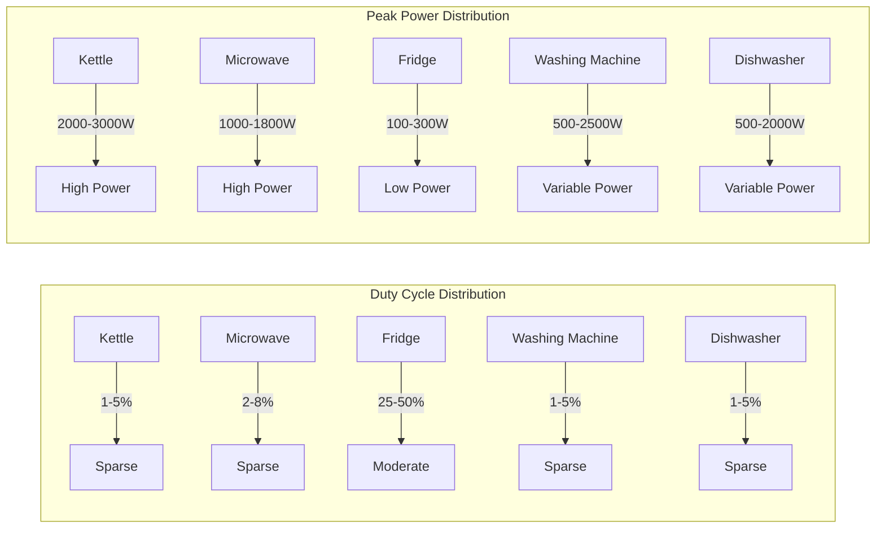
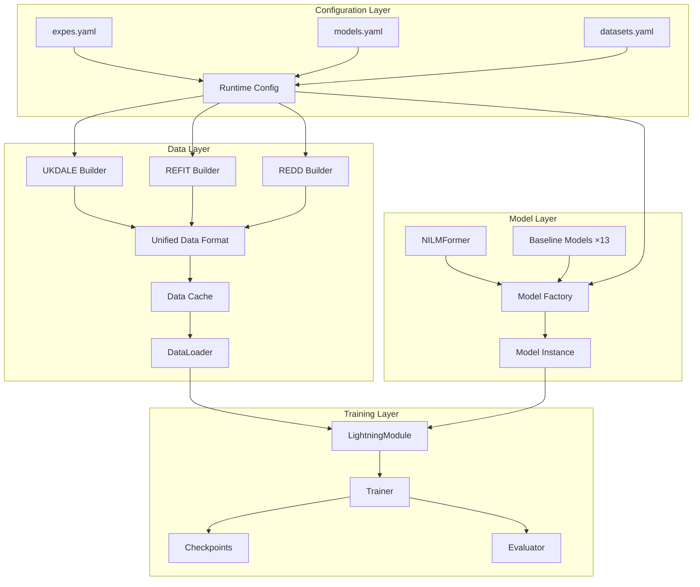
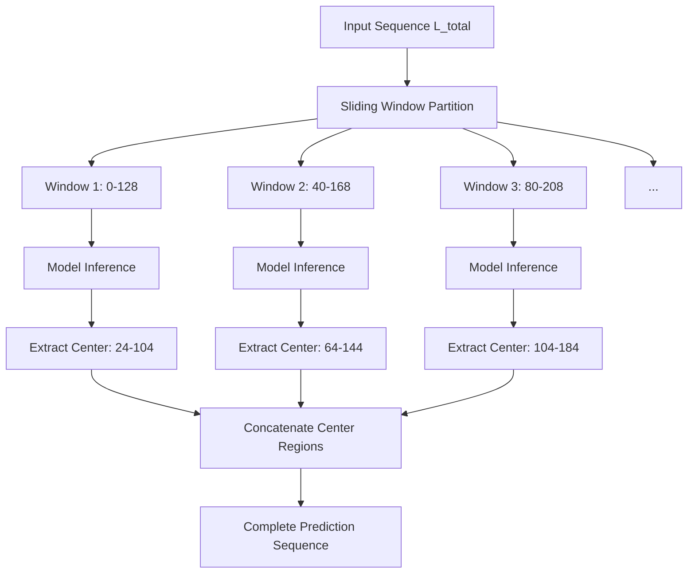

# Chapter 4: System Implementation and Experimental Setup

## 4.1 Introduction

The preceding chapter elaborated on the methodological design of CondiNILMformer from a theoretical perspective, including the conditional feature modulation framework, multi-device adaptive architecture, and device-aware loss function. This chapter discusses how to transform these theoretical designs into an executable software system, and introduces the datasets, evaluation metrics, and training configurations required for experimental evaluation.

The core challenge in system implementation lies in balancing flexibility with efficiency. On one hand, NILM research requires support for flexible combinations of multiple datasets, multiple devices, and multiple models; on the other hand, deep learning training has high demands for computational efficiency. This thesis adopts a modular architecture design, decoupling data processing, model definition, loss computation, and training procedures into independent components coordinated through a unified configuration system. This design enables researchers to adjust experimental parameters through configuration files rather than source code modifications, while ensuring experimental reproducibility.

This chapter is organized as follows: Section 4.2 introduces the three public NILM datasets used in experiments; Section 4.3 describes the specific implementation of the model architecture; Section 4.4 elaborates on training and evaluation configuration details; Section 4.5 summarizes the chapter.

## 4.2 Evaluation Datasets

### 4.2.1 Dataset Overview

This thesis conducts experimental evaluation on three widely-used public NILM datasets: UK-DALE, REFIT, and REDD. These datasets originate from real household electricity records in different countries and time periods, encompassing diverse electricity usage patterns and appliance types, enabling comprehensive examination of method generalization capability. Table 4.1 summarizes the basic characteristics of the three datasets.

| Dataset | Country | Houses | Sampling Rate | Recording Duration | Main Appliances |
|---------|---------|--------|---------------|-------------------|-----------------|
| UK-DALE | UK | 5 | 6 seconds | 2-4 years | Kettle, Microwave, Fridge, Washing Machine, Dishwasher |
| REFIT | UK | 20 | 8 seconds | 2 years | Fridge, Washing Machine, Dishwasher, TV, Computer |
| REDD | USA | 6 | 1s/15s | 3-19 days | Fridge, Microwave, Washing Machine, Dishwasher |

### 4.2.2 UK-DALE Dataset

The UK Domestic Appliance-Level Electricity (UK-DALE) dataset was released by Kelly and Knottenbelt in 2015 and is one of the most influential benchmark datasets in the NILM field. The dataset records long-term electricity usage data from 5 UK households, with both aggregate power and individual appliance power stored at 6-second sampling rate.

A distinctive feature of UK-DALE is its long recording duration (some houses exceeding 4 years), covering complete seasonal variations and lifestyle pattern evolution. This characteristic makes it an ideal choice for evaluating model long-term generalization capability. However, the dataset also has limitations: the number of houses is relatively small (only 5), appliance configurations vary significantly across houses, and certain appliances are only available in some houses.

This thesis selects five representative target appliances for experiments:
- **Kettle**: A typical sparse high-power appliance with peak power of 2000-3000W, single use duration of 1-3 minutes, and duty cycle typically below 3%
- **Microwave**: A short-duration high-power pulse-type appliance with peak power of 1000-1500W and irregular usage patterns
- **Fridge**: A periodically operating appliance with compressor cycling period of approximately 15-30 minutes, average power of 50-150W, and duty cycle of 30-50%
- **Washing Machine**: A long-cycle multi-stage appliance with single operation lasting 1-2 hours, including different power stages such as heating, washing, and spinning
- **Dishwasher**: Similar to washing machine, a long-cycle appliance with single operation lasting 1-2 hours

### 4.2.3 REFIT Dataset

The REFIT (Personalised Retrofit Decision Support Tools for UK Homes using Smart Home Technology) dataset contains electricity records from 20 UK households over a two-year period. Compared to UK-DALE, REFIT has more houses, providing richer diversity in household electricity usage patterns.

REFIT's sampling rate is 8 seconds, slightly lower than UK-DALE's 6 seconds, but sufficient for minute-level analysis. The dataset has relatively standardized annotations with good device naming consistency and low missing data rate. However, some houses lack sub-metering for certain appliances, meaning not all target appliances are available in all houses.

On REFIT, this thesis primarily evaluates three appliances—fridge, washing machine, and dishwasher—which have complete records in most houses.

### 4.2.4 REDD Dataset

The Reference Energy Disaggregation Data Set (REDD) is one of the earliest public datasets released in the NILM field, released by MIT in 2011. The dataset records electricity usage data from 6 US households, with high-frequency data sampled at up to 15kHz and low-frequency data at 1-second or 15-second intervals.

REDD's unique value lies in its US background—compared to UK datasets, US households have different appliance configurations and electricity usage habits (such as voltage standards and common appliance types). Evaluation on REDD can examine the method's cross-regional generalization capability.

However, REDD also has notable limitations: short recording duration (maximum only 19 days), variable data quality (some houses have substantial missing data), and inconsistent device naming (such as "dish washer" and "dishwasher" used interchangeably). This thesis performs device name standardization and data quality filtering when using REDD.

### 4.2.5 Dataset Statistical Characteristics

Figure 4.1 shows the statistical characteristic distribution of main appliances across the three datasets. Observable patterns include:

These differences in statistical characteristics are precisely the motivation for the device-aware methods proposed in this thesis: kettle and microwave's sparse high-power characteristics require the model to have keen event detection capability; fridge's periodicity and moderate duty cycle require the model to stably track power fluctuations; washing machine and dishwasher's long-cycle multi-stage characteristics require the model to capture complex power evolution patterns.

## 4.3 Model Implementation

### 4.3.1 System Architecture

The CondiNILMformer system adopts a layered modular architecture, primarily comprising four layers:

**Configuration layer** manages all experimental parameters using hierarchically-structured YAML configuration files. The main configuration file defines default parameters, model and dataset configuration files provide specific overrides, and command-line parameters allow runtime adjustments. The configuration system uses the OmegaConf library to implement recursive merging and type validation.

**Data layer** handles data loading, preprocessing, and batch construction. Dedicated data builder classes are implemented for each dataset, outputting four-dimensional tensors in a unified format. The data caching mechanism avoids redundant preprocessing through unique key-value pairs, accelerating experimental iteration.

**Model layer** contains the CondiNILMformer main model and PyTorch implementations of 13 baseline models. The model factory pattern unifies instantiation interfaces, supporting dynamic parameter injection.

**Training layer** is built on the PyTorch Lightning framework, providing standardized training loops, checkpoint management, and distributed training support.

Figure 4.2 illustrates the system's data flow and module interactions:

### 4.3.2 Data Preprocessing Implementation

The data preprocessing pipeline converts raw power data into a standardized format usable by the model, primarily including the following steps:

**Resampling and Alignment**: Raw data at different sampling rates is unified to the target sampling rate (default 1 minute). Resampling uses mean aggregation strategy, reducing temporal resolution while maintaining the physical meaning of power. Time alignment ensures strict correspondence between aggregate power and individual appliance power on the time axis.

**Data Cleaning**: Handles missing values, outliers, and noise. Short-term missing data (continuous duration below threshold) is filled using linear interpolation; long-term missing data is marked as invalid intervals and excluded during window partitioning. Negative power values are set to zero, and extreme high values are clipped to reasonable upper limits. Tiny fluctuations below sensor precision (<5W) are set to zero to eliminate noise.

**State Label Computation**: Binary activation states are computed based on device-specific power thresholds and temporal parameters. After initial threshold determination, temporal filtering suppresses spurious activations and deactivations shorter than minimum duration. State labels are used for soft weighting in loss functions and classification metric computation during evaluation.

**Sliding Window Partitioning**: Continuous sequences are segmented into fixed-length windows. Both non-overlapping mode (adjacent windows independent) and overlapping mode (adjacent windows share some time points) are supported. Window partitioning follows a three-level anti-leakage strategy: data from different houses is assigned to different dataset splits; temporal gaps are maintained between training and validation data within the same house; only valid windows passing quality checks are used.

**Exogenous Variable Encoding**: Periodic features are extracted from timestamps (hour, day of week, month, etc.) and converted to continuous vectors using trigonometric encoding. Encoded temporal features are concatenated with power sequences as auxiliary model inputs.

### 4.3.3 Model Architecture Implementation

The CondiNILMformer model is implemented using the PyTorch framework, with approximately 2M total parameters, default model dimension (d_model) of 176, and default encoder layer count of 4. The following describes implementation details of each component.

**Instance Normalization** is executed at the beginning of forward propagation, computing mean and standard deviation for each sample in the current batch. Statistics are detached from the computation graph to avoid participating in gradient propagation. Standard deviation has a lower bound (default 0.01) to prevent division by zero. Normalized statistics are converted to statistics tokens through linear projection.

**Multi-Scale Dilated Convolution Embedding** consists of four residual units with dilation rates {1, 2, 4, 8}. Each unit contains dilated convolution, GELU activation, and batch normalization, using "same" padding to maintain temporal dimension. Residual connections use 1×1 convolution for channel matching when input and output channels differ.

**Conditioning Feature Computation** is performed in real-time during each forward pass. Electrical features (mean, standard deviation, RMS, peak, crest factor) are computed directly through PyTorch tensor operations. Frequency features use torch.fft.rfft to compute magnitude spectrum, then aggregate across 8 frequency bands along the frequency axis. Both feature types are concatenated to form a 13-dimensional conditioning vector.

**FiLM Parameter Generation** uses a two-layer MLP. Device embeddings are queried through nn.Embedding, concatenated with conditioning vectors, passed through the first MLP layer with ReLU activation, and the second MLP layer outputs raw γ and β parameters. Parameters are scaled by 0.1×tanh before being applied to features. To support multiple devices, encoder FiLM parameters are averaged across all target devices before being applied to shared encoder layers.

**Diagonally-Masked Self-Attention** modifies standard multi-head attention. After computing attention scores, diagonal positions are filled with -1e4 (approximate negative infinity), resulting in near-zero attention weights at diagonal positions after softmax. Diagonal positions are subsequently explicitly set to zero to ensure numerical stability.

**Device Adapters** are independently instantiated for each target device. Adapters contain two 1×1 convolution layers with intermediate dimension half of input dimension. Adapter output is multiplied by 0.1 residual weight before being added to shared features.

**Type-Grouped Output Heads** establish grouping mappings based on configured device type IDs. Same-group devices share output head parameters, with each output head using 1×1 convolution to generate power predictions and gating logits. Final output is fused through the soft gating formula.

### 4.3.4 Loss Function Implementation

The composite loss function is implemented in a custom Loss module, receiving predictions, targets, and state labels as inputs, returning weighted total loss and a dictionary of component losses.

**Soft Threshold Weight Computation** uses the sigmoid function: $p_{on} = \sigma((y - \tau) / T)$, where τ is the device activation threshold and T is the softening temperature (default 0.1). $p_{off} = 1 - p_{on}$. This design avoids gradient discontinuity problems from hard thresholds.

**Main Regression Loss** uses SmoothL1Loss (Huber loss) to compute point-wise errors, then separately computes weighted averages by $p_{on}$ and $p_{off}$, finally combining with $\alpha_{on}$ and $\alpha_{off}$.

**Recall and False Positive Losses** use ReLU as activation function: recall loss is the weighted average of $\text{ReLU}(r \cdot y - \hat{y}) \cdot p_{on}$, false positive loss is the weighted average of $\text{ReLU}(\hat{y} - \delta) \cdot p_{off}$.

**Relative Error Loss** adds a small constant (1e-6) to target values before computation to prevent division by zero, and clips results to [0, 2] range to prevent extreme values from dominating gradients.

**Energy Loss** computes relative error between predicted and target power sums within the window, with similar clipping treatment.

**Device-Aware Parameters** are derived from data statistics before training begins. The parameter derivation function classifies devices based on duty cycle, peak power, and other characteristics, then queries predefined parameter tables and fine-tunes based on actual statistics.

### 4.3.5 Baseline Models

To comprehensively evaluate CondiNILMformer's performance, this thesis implements 13 baseline models covering different architectural paradigms:

**Recurrent network baselines**: BiGRU and BiLSTM, using bidirectional recurrent units to model sequential dependencies, are classic methods in the NILM field.

**Convolutional network baselines**: CNN1D, FCN, DResNet, DAResNet, using one-dimensional convolution to capture local patterns; DResNet and DAResNet introduce residual connections and attention mechanisms.

**U-Net architecture**: UNET_NILM, adopting encoder-decoder structure with skip connections, suitable for sequence-to-sequence tasks.

**Transformer baselines**: BERT4NILM (BERT architecture applied to NILM), Energformer (energy-aware Transformer), and the original NILMformer.

**Hybrid architectures**: TSILNet (TCN+LSTM hybrid), STNILM (mixture of experts model).

**Diffusion model**: DiffNILM, a generative method based on diffusion processes.

All baseline models use identical data preprocessing and evaluation procedures to ensure fair comparison.

## 4.4 Training and Evaluation Configuration

### 4.4.1 Data Partitioning Strategy

Experiments adopt house-level data partitioning, ensuring training and test sets come from different houses. Specific partitions are as follows:

**UK-DALE**: Houses 1 and 2 for training and validation, House 5 for testing. This partition follows common practice in the NILM field, as House 5 has good data quality and contains all target appliances.

**REFIT**: Houses are dynamically selected based on device availability. For each device, a subset of houses with complete records is selected and split 8:2 into training and test sets.

**REDD**: Due to short recording duration, a more conservative partition is used. Houses 1 and 2 for training, House 3 for testing. Only device data passing quality checks is used.

Within the training set, a time-block partitioning strategy creates the validation set. Temporal gaps are maintained between training and validation data, with gap size equal to window length divided by step size, ensuring sufficient temporal separation between validation and training data.

### 4.4.2 Training Configuration

Table 4.2 lists the main training hyperparameters and their default values. These parameters were determined through hyperparameter search on the UK-DALE dataset and typically achieve good performance on other datasets without adjustment.

| Parameter | Default Value | Description |
|-----------|---------------|-------------|
| Batch Size | 128 | Number of samples per training batch |
| Training Epochs | 25 | Maximum number of training epochs |
| Learning Rate | 3×10⁻⁴ | Initial learning rate for AdamW optimizer |
| Weight Decay | 0.04 | L2 regularization strength |
| Warmup Epochs | 3 | Number of epochs for linear learning rate warmup |
| Early Stopping Patience | 5 | Tolerance epochs for validation loss not improving |
| Window Length | 128 | Number of time steps in input sequence |
| Sampling Rate | 1 minute | Temporal resolution after resampling |

**Optimizer Configuration**: Uses AdamW optimizer with β₁=0.9, β₂=0.999, ε=1e-8. AdamW decouples weight decay from gradient updates, typically outperforming standard Adam on Transformer-class models.

**Learning Rate Scheduling**: Adopts cosine annealing warmup strategy. Linear warmup for first 3 epochs, then cosine decay from initial learning rate to 1e-6. Compared to step-wise decay, cosine scheduling provides smoother learning rate changes, helping avoid oscillation in late training.

**Mixed Precision Training**: FP16 mixed precision training is enabled on supporting GPUs, with forward propagation using half precision and gradient accumulation using full precision. This configuration can improve training speed by over 50% while reducing memory usage by approximately 40%.

**Gradient Clipping**: L2 norm upper limit for gradients is set to 1.0 to prevent gradient explosion, a standard configuration for Transformer training.

### 4.4.3 Evaluation Metrics

This thesis adopts the universal evaluation metric system in the NILM field, covering two dimensions: regression accuracy and event detection.

**Regression metrics** evaluate power prediction accuracy:

- **MAE (Mean Absolute Error)**: Average absolute error between predicted and actual power, in watts, intuitively reflecting average bias in power estimation
- **RMSE (Root Mean Square Error)**: Root mean square error, more sensitive to large errors
- **NDE (Normalized Disaggregation Error)**: Normalized disaggregation error, defined as the ratio of squared prediction error sum to squared actual power sum, providing a relative error measure
- **SAE (Signal Aggregate Error)**: Signal aggregate error, measuring relative deviation in total energy prediction

**Classification metrics** evaluate device activation state detection performance:

- **F1 Score**: Harmonic mean of precision and recall, comprehensively measuring detection performance
- **Precision**: Proportion of predicted ON states that are truly ON, reflecting false alarm rate
- **Recall**: Proportion of true ON states correctly detected, reflecting missed detection rate

State detection binarizes predictions and actual power using device-specific power thresholds, then computes classification metrics.

### 4.4.4 Seq2Subseq Inference

Training uses sliding window methods, but inference requires outputting complete prediction sequences of equal length to input. This thesis adopts Seq2Subseq inference strategy:

1. Partition input sequence into overlapping windows, with step size equal to window center region length
2. Execute model inference on each window, obtaining complete window predictions
3. Retain only center region predictions (approximately 63%) from each window
4. Concatenate center predictions from all windows to form complete output sequence

This strategy ensures that final predictions all come from window centers with complete context, eliminating boundary effects. Figure 4.3 illustrates the Seq2Subseq inference process:

### 4.4.5 Post-Processing

Raw model outputs require post-processing before final evaluation. Post-processing includes two steps:

**Threshold Clipping**: Predictions below device-specific thresholds are set to zero. Thresholds are set based on device typical standby power, e.g., kettle threshold is higher (50-100W) to filter noise, fridge threshold is lower (15-25W) to preserve low-power operation.

**Short Activation Suppression**: Predicted activations with duration shorter than minimum ON time are set to zero. This step eliminates spurious short activations caused by noise or model fluctuation, with parameters set based on device physical characteristics (kettle 1 step, fridge 4 steps, washing machine 8 steps).

Post-processing parameters are specified per-device in configuration files, supporting flexible adjustment for different datasets and devices.

### 4.4.6 Hyperparameter Optimization

This thesis uses the Optuna framework for Bayesian hyperparameter optimization. The search space includes model architecture parameters (model dimension, layer count, attention head count, dropout rate) and training parameters (learning rate, weight decay).

The optimization objective is weighted F1 score on the validation set, with higher weights assigned to difficult devices (microwave, kettle), encouraging better model performance on sparse appliances. The TPE (Tree-structured Parzen Estimator) sampler is used to intelligently select the next parameter set based on historical trial results.

After 50 trials, the optimal parameters determined are: d_model=176, n_layers=4, n_head=8, dp_rate=0.08, lr=3×10⁻⁴, wd=0.04. These parameters perform well across all datasets.

## 4.5 Chapter Summary

This chapter provided detailed coverage of the system implementation and experimental setup for CondiNILMformer.

Regarding evaluation datasets, this thesis selected three representative public NILM datasets: UK-DALE provides long-term high-quality UK household data, REFIT provides diverse household electricity usage patterns, and REDD provides cross-regional validation scenarios from US households. The three datasets cover different device types, data quality levels, and electricity usage patterns, enabling comprehensive evaluation of method generalization capability.

Regarding model implementation, this thesis adopts modular architecture design, decoupling configuration management, data processing, model definition, and training procedures into independent components. PyTorch and PyTorch Lightning frameworks provide efficient tensor computation and standardized training infrastructure. Key component implementations follow best practices, including numerical stability handling, gradient clipping, and mixed precision training.

Regarding training and evaluation, this thesis designs rigorous data partitioning strategies to prevent information leakage, adopts multi-dimensional evaluation metrics for comprehensive performance measurement, uses Seq2Subseq inference strategy to eliminate boundary effects, and improves prediction quality through post-processing steps. Hyperparameter optimization based on Bayesian methods finds well-performing parameter configurations within limited search budget.

The next chapter will report experimental results under the above datasets and configurations, with detailed comparisons to baseline methods.
