# Mermaid Diagram 1: Overall System Architecture

> This Mermaid diagram shows the complete end-to-end architecture of CondiNILM/NILMFormer.
> Use this as the main navigation map for the WebGL visualization.

## Diagram

```mermaid
graph TD
    subgraph INPUT["Input Processing"]
        A["Raw Aggregate Power<br/>Shape: (B, 1, L)<br/>1D time series in Watts"]
        B["Temporal Encoding<br/>sin/cos(month, day, hour)<br/>Shape: (B, 6, L)"]
        A --> C["Concatenate<br/>Shape: (B, 7, L)<br/>1 power + 6 temporal"]
        B --> C
    end

    subgraph EMBED["Embedding Stage"]
        C --> D["Instance Normalization<br/>(x - mean) / std<br/>Shape: (B, 7, L)"]
        D --> E["DilatedBlock<br/>4x ResUnit (d=1,2,4,8)<br/>Conv1d + GELU + BN<br/>(B, 7, L) → (B, 8, L)"]
        E --> F["+ Learnable Pos Encoding<br/>Shape: (1, 8, L)<br/>broadcast over batch"]
        F --> G["Input Projection<br/>Conv1d(8, 96, k=1)<br/>(B, 8, L) → (B, 96, L)"]
        G --> H["Transpose<br/>(B, 96, L) → (B, L, 96)<br/>Conv format → Transformer format"]
    end

    subgraph COND["Condition Feature Extraction"]
        C --> |"power channel only"| CF["_compute_condition_features<br/>Input: (B, 1, L)"]
        CF --> EF["Electrical Features<br/>mean, std, rms, peak, crest<br/>Shape: (B, 5)"]
        CF --> FF["Frequency Features<br/>FFT → 8-band magnitude<br/>Shape: (B, 8)"]
        EF --> COND_VEC["Condition Vector<br/>Shape: (B, 13)<br/>5 elec + 8 freq"]
        FF --> COND_VEC
    end

    subgraph FILM_GEN["FiLM Parameter Generation"]
        COND_VEC --> DE["Device Embeddings<br/>nn.Embedding(5, 32)<br/>Shape: (B, 5, 32)"]

        DE --> ENC_FILM["Encoder FiLM MLP<br/>Linear(45→32→576)<br/>576 = 3 layers × 2 × 96"]
        COND_VEC --> |"expand to 5 devices"| ENC_FILM

        DE --> DEC_FILM["Decoder FiLM MLP<br/>Linear(45→32→2)<br/>2 = gamma + beta"]
        COND_VEC --> |"expand to 5 devices"| DEC_FILM

        ENC_FILM --> ENC_PARAMS["Encoder FiLM Params<br/>gamma: (B, 5, 3, 96)<br/>beta: (B, 5, 3, 96)<br/>→ avg over devices<br/>→ (B, 1, 96) per layer"]

        DEC_FILM --> DEC_PARAMS["Decoder FiLM Params<br/>gamma: (B, 5, 1)<br/>beta: (B, 5, 1)<br/>per-device scalar"]
    end

    subgraph ENCODER["Transformer Encoder (3 Layers)"]
        H --> EL0

        subgraph EL0["Encoder Layer 0"]
            LN0a["LayerNorm"] --> ATT0["Diagonal-Masked<br/>Multi-Head Attention<br/>8 heads × 12 dim"]
            ATT0 --> RES0a["+ Residual"]
            RES0a --> LN0b["LayerNorm"]
            LN0b --> FFN0["FFN<br/>96→384→96<br/>GELU + Dropout"]
            FFN0 --> FILM0["FiLM<br/>(1+γ₀)·x + β₀"]
            FILM0 --> RES0b["+ Residual"]
        end

        ENC_PARAMS --> |"γ₀, β₀"| FILM0
        RES0b --> EL1

        subgraph EL1["Encoder Layer 1"]
            LN1a["LayerNorm"] --> ATT1["Diagonal-Masked<br/>Multi-Head Attention"]
            ATT1 --> RES1a["+ Residual"]
            RES1a --> LN1b["LayerNorm"]
            LN1b --> FFN1["FFN<br/>96→384→96"]
            FFN1 --> FILM1["FiLM<br/>(1+γ₁)·x + β₁"]
            FILM1 --> RES1b["+ Residual"]
        end

        ENC_PARAMS --> |"γ₁, β₁"| FILM1
        RES1b --> EL2

        subgraph EL2["Encoder Layer 2"]
            LN2a["LayerNorm"] --> ATT2["Diagonal-Masked<br/>Multi-Head Attention"]
            ATT2 --> RES2a["+ Residual"]
            RES2a --> LN2b["LayerNorm"]
            LN2b --> FFN2["FFN<br/>96→384→96"]
            FFN2 --> FILM2["FiLM<br/>(1+γ₂)·x + β₂"]
            FILM2 --> RES2b["+ Residual"]
        end

        ENC_PARAMS --> |"γ₂, β₂"| FILM2
    end

    RES2b --> TR["Transpose Back<br/>(B, L, 96) → (B, 96, L)"]

    subgraph HEADS["Device-Specific Heads"]
        TR --> DH0["Device 0: Kettle<br/>SparseDeviceCNN<br/>Conv(96→64→64→2)<br/>Output: power + gate"]
        TR --> DH1["Device 1: Microwave<br/>SparseDeviceCNN<br/>Conv(96→64→64→2)"]
        TR --> DH2["Device 2: Fridge<br/>SimpleDeviceHead<br/>Shared Conv(96→128→128)<br/>+ Classification branch<br/>+ Regression branch<br/>+ Smoothstep Gate"]
        TR --> DH3["Device 3: Dishwasher<br/>SimpleDeviceHead"]
        TR --> DH4["Device 4: Washer<br/>SimpleDeviceHead"]
    end

    subgraph OUTPUT["Output Assembly"]
        DH0 --> FILM_OUT0["FiLM: (1+γ₀)·p + β₀"]
        DH1 --> FILM_OUT1["FiLM: (1+γ₁)·p + β₁"]
        DH2 --> FILM_OUT2["FiLM: (1+γ₂)·p + β₂"]
        DH3 --> FILM_OUT3["FiLM: (1+γ₃)·p + β₃"]
        DH4 --> FILM_OUT4["FiLM: (1+γ₄)·p + β₄"]

        DEC_PARAMS --> FILM_OUT0
        DEC_PARAMS --> FILM_OUT1
        DEC_PARAMS --> FILM_OUT2
        DEC_PARAMS --> FILM_OUT3
        DEC_PARAMS --> FILM_OUT4

        FILM_OUT0 --> CAT["Concatenate<br/>dim=1"]
        FILM_OUT1 --> CAT
        FILM_OUT2 --> CAT
        FILM_OUT3 --> CAT
        FILM_OUT4 --> CAT
    end

    CAT --> FINAL["Final Output<br/>power: (B, 5, L)<br/>gate: (B, 5, L)<br/>5 appliance predictions"]

    %% Styling
    style A fill:#e1f5fe,stroke:#0288d1
    style FINAL fill:#c8e6c9,stroke:#388e3c
    style COND_VEC fill:#fff3e0,stroke:#f57c00
    style ENC_PARAMS fill:#fce4ec,stroke:#c2185b
    style DEC_PARAMS fill:#fce4ec,stroke:#c2185b
    style FILM0 fill:#fce4ec,stroke:#c2185b
    style FILM1 fill:#fce4ec,stroke:#c2185b
    style FILM2 fill:#fce4ec,stroke:#c2185b
    style ATT0 fill:#e8eaf6,stroke:#3f51b5
    style ATT1 fill:#e8eaf6,stroke:#3f51b5
    style ATT2 fill:#e8eaf6,stroke:#3f51b5
```



## Tensor Shape Annotations

```
Every connection in the diagram carries a tensor:

INPUT → Instance Norm:          (B, 7, L)
Instance Norm → DilatedBlock:   (B, 7, L)
DilatedBlock → Pos Encoding:    (B, 8, L)
Pos Encoding → Projection:      (B, 8, L)
Projection → Transpose:         (B, 96, L)
Transpose → Encoder:            (B, L, 96)
Encoder → Encoder → Encoder:    (B, L, 96)  [unchanged through layers]
Encoder → Transpose Back:       (B, L, 96)
Transpose Back → Device Heads:  (B, 96, L)
Device Head Output:              (B, 1, L)  per device
After Concat:                    (B, 5, L)

FiLM paths:
Condition → Encoder FiLM:        (B, 1, 96) per layer
Condition → Decoder FiLM:        (B, 5, 1)

B = 32, L = 480 in default config
```
