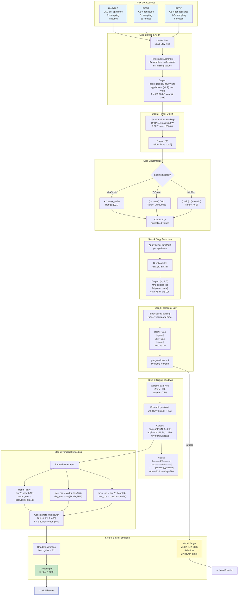

# Mermaid Diagram 2: Data Preprocessing Pipeline

> This diagram shows how raw power measurements are transformed into model-ready tensors.

## Diagram



## Tensor Shape Evolution Table

```
Step              Tensor                    Shape               Values
────────────────  ────────────────────────  ──────────────────  ──────────────
1. Load           aggregate                 (T,)                [0, ~10000] W
                  appliances                (M, T)              [0, ~3000] W
2. Cutoff         aggregate                 (T,)                [0, 6000] W
3. Normalize      aggregate                 (T,)                [0, 1]
4. State          combined                  (M, 2, T)           power:[0,1] state:{0,1}
5. Split          train/val/test            3 subsets of above
6. Window         agg_windows               (N, 1, 480)         [0, 1]
                  app_windows               (N, M, 2, 480)      power+state
7. Temporal       input                     (N, 7, 480)         power + sin/cos
8. Batch          x                         (32, 7, 480)        model input
                  y                         (32, 5, 2, 480)     model target

T ≈ 525,600 (1 year @ 1 min)
M = 5 appliances
N = (T - 480) / 120 + 1 ≈ 4,376 windows per year
```
