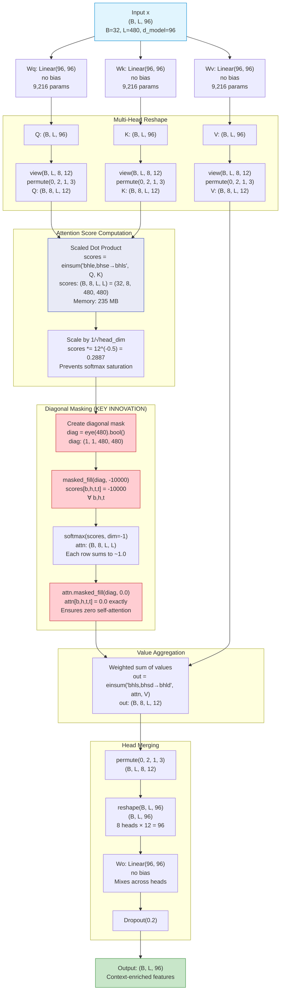
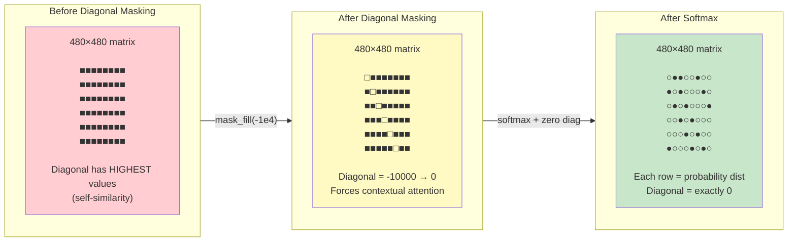

# Mermaid Diagram 3: Multi-Head Self-Attention Detail

> This diagram shows the complete attention computation including Q/K/V projection, multi-head split, scaled dot-product, diagonal masking, and head merging.

## Diagram



## Attention Matrix Visualization



## Per-Head Attention Pattern

```
Head specialization (learned through training):

Head 0: LOCAL CONTEXT
    Strong attention to positions ±1, ±2, ±3
    Captures immediate temporal neighbors
    Pattern: diagonal bands

Head 1: PERIODIC PATTERNS
    Attention peaks at regular intervals
    Captures fridge cycling (~15 min period)
    Pattern: evenly spaced dots

Head 2: EVENT DETECTION
    High attention to positions with power spikes
    Captures appliance ON/OFF events
    Pattern: sparse bright spots

Head 3: GLOBAL CONTEXT
    Relatively uniform attention
    Captures overall power level context
    Pattern: flat/uniform

Head 4-7: MIXED PATTERNS
    Combinations of local, periodic, and event patterns
    Different devices trigger different heads

All heads: ZERO on diagonal (enforced by masking)
```
