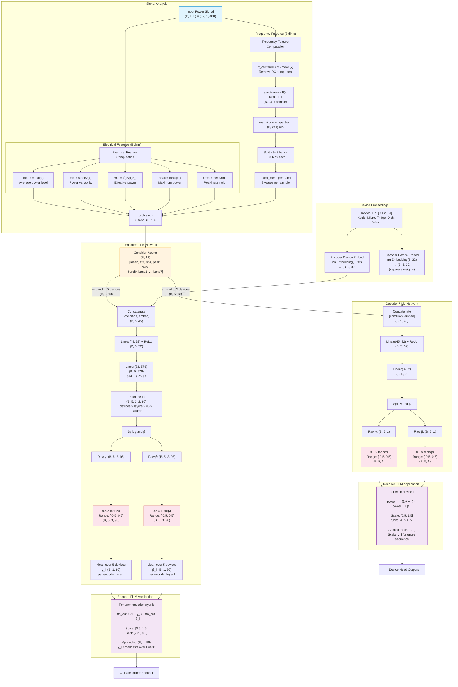
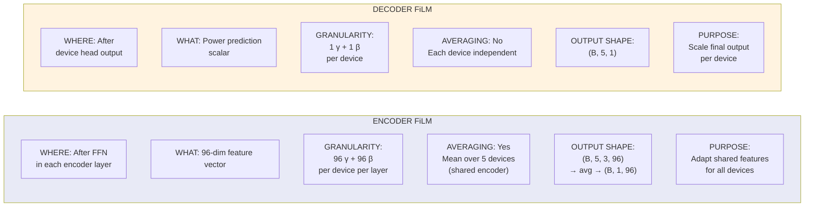

# Mermaid Diagram 4: FiLM Conditioning Flow

> This diagram shows the complete FiLM (Feature-wise Linear Modulation) pipeline from condition extraction to modulation application.

## Diagram: Complete FiLM System



## Encoder vs Decoder FiLM Comparison



## Numerical Flow Example

```
CONCRETE EXAMPLE (B=1, device=kettle, layer=0):

Input signal: household power = [0.1, 0.1, 0.8, 0.9, 0.85, 0.1, 0.1, ...]
                                 idle  idle  kettle ON...    idle

Condition features computed:
    mean  = 0.35    (moderate average)
    std   = 0.35    (high variability)
    rms   = 0.48    (high effective power)
    peak  = 0.95    (near maximum)
    crest = 1.98    (moderately peaky)
    band0 = 2.1     (strong low-frequency)
    band1 = 0.8     (some mid-low)
    band2 = 0.3     (weak mid)
    band3..7 = ~0.1 (minimal high-freq)

    condition = [0.35, 0.35, 0.48, 0.95, 1.98, 2.1, 0.8, 0.3, 0.1, 0.08, 0.05, 0.03, 0.02]
                                                                              13 values total

Kettle embedding (learned):
    embed_kettle = [0.3, -0.1, 0.5, ..., 0.2]    (32 values)

Concatenated:
    inp = [0.35, 0.35, ..., 0.02, 0.3, -0.1, ..., 0.2]    (45 values)

After MLP:
    Encoder gamma for kettle, layer 0: 96 values in [-0.5, 0.5]
    Encoder beta for kettle, layer 0: 96 values in [-0.5, 0.5]

    Example: gamma = [0.3, -0.1, 0.4, ...]  (amplify some features, dampen others)
             beta  = [0.05, -0.02, 0.1, ...] (shift features)

After averaging with 4 other devices:
    gamma_avg = [0.15, -0.05, 0.2, ...]   (less extreme, balanced)
    beta_avg  = [0.02, -0.01, 0.05, ...]

Application in encoder layer 0:
    ffn_out[position_42] = [0.3, -0.5, 1.2, ...]

    modulated = (1 + [0.15, -0.05, 0.2, ...]) × [0.3, -0.5, 1.2, ...] + [0.02, -0.01, 0.05, ...]
              = [1.15×0.3+0.02, 0.95×(-0.5)-0.01, 1.2×1.2+0.05, ...]
              = [0.365, -0.485, 1.49, ...]
```
