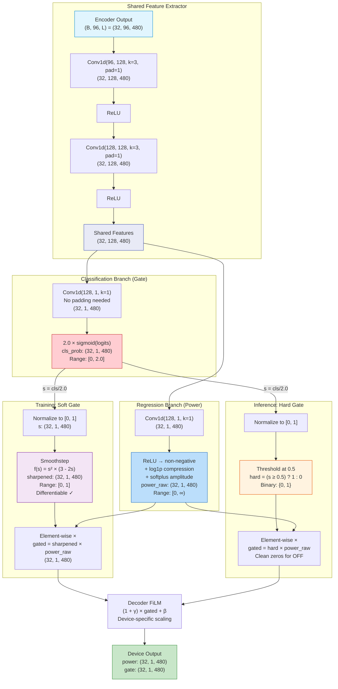
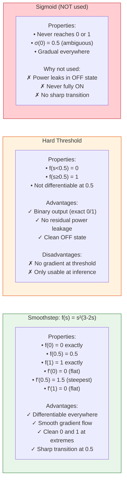
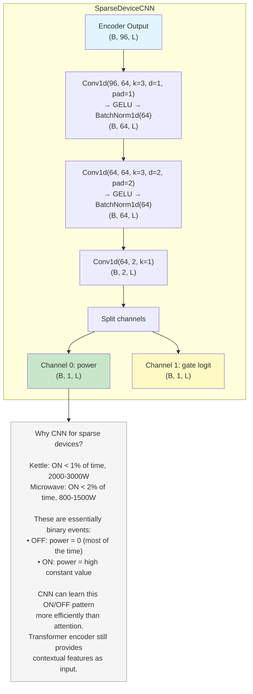

# Mermaid Diagram 5: Gate Mechanism Detail

> This diagram shows the dual-branch device head architecture and the soft/hard gate mechanism.

## Diagram: SimpleDeviceHead Architecture



## Diagram: Smoothstep vs Hard Gate Comparison



## Diagram: SparseDeviceCNN (Kettle/Microwave)



## Gate Effect Visualization Data

```
EXAMPLE: Fridge cycling (480 timesteps, showing 13 key positions)

Position:        0    50   100  150  200  250  300  350  400  420  440  460  479
                 │    │    │    │    │    │    │    │    │    │    │    │    │

cls_prob/2:     0.92 0.90 0.85 0.15 0.08 0.05 0.06 0.12 0.88 0.91 0.93 0.90 0.89
                 ON   ON   ON   OFF  OFF  OFF  OFF  trans ON   ON   ON   ON   ON

power_raw:       120  125  118   40   20   15   18   65  115  122  120  118  116
                 (W)  (W)  (W)  (W)  (W)  (W)  (W)  (W)  (W)  (W)  (W)  (W)  (W)

smoothstep(s):  0.98 0.97 0.94 0.04 0.01 0.00 0.01 0.03 0.93 0.97 0.98 0.97 0.96
                near1 near1 near1 near0 near0 zero near0 near0 near1 near1 near1 near1 near1

SOFT gate out:  117.6 121.3 110.9 1.6  0.2  0.0  0.2  2.0  107.0 118.3 117.6 114.5 111.4
                 ON    ON    ON   ~0   ~0    0   ~0   ~0    ON    ON    ON    ON    ON

HARD gate out:   120  125  118    0    0    0    0    0   115  122  120  118  116
(threshold=0.5)  ON   ON   ON    OFF  OFF  OFF  OFF  OFF  ON   ON   ON   ON   ON

Observation:
    - Soft gate: smooth transition, small residuals during OFF
    - Hard gate: clean zeros during OFF, exact power during ON
    - Both correctly identify the ON/OFF cycling pattern
    - Smoothstep provides gradients for training
    - Hard threshold provides clean outputs for evaluation
```
