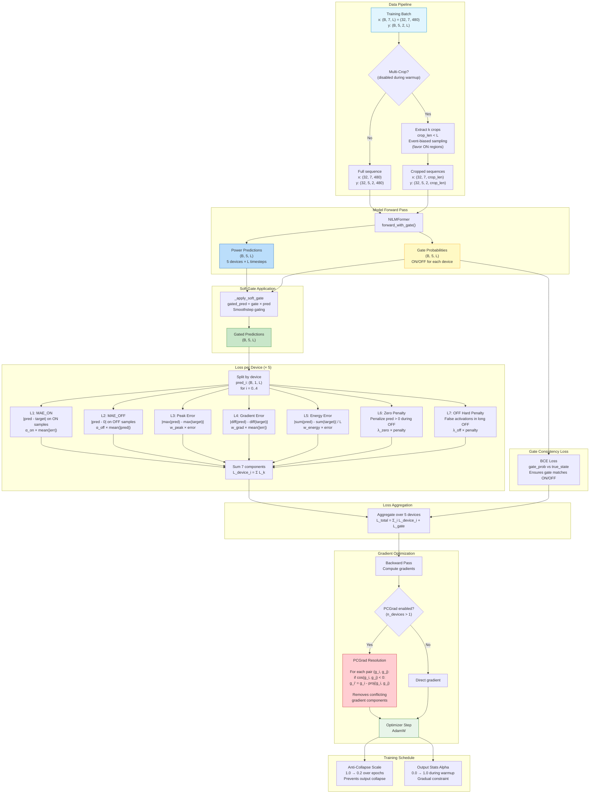
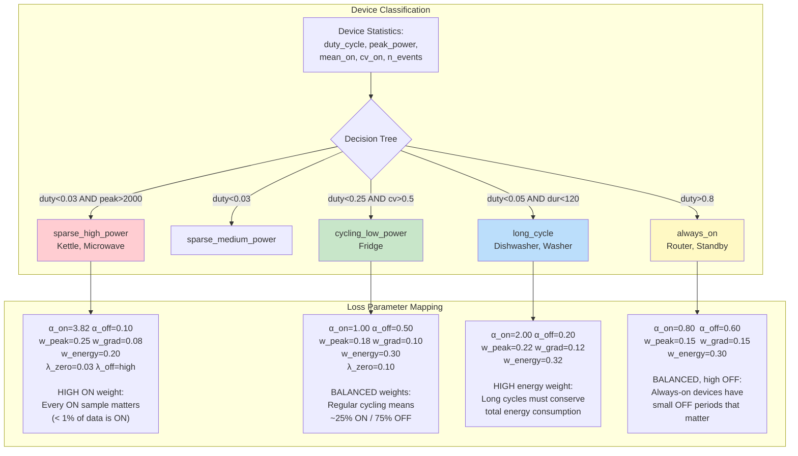
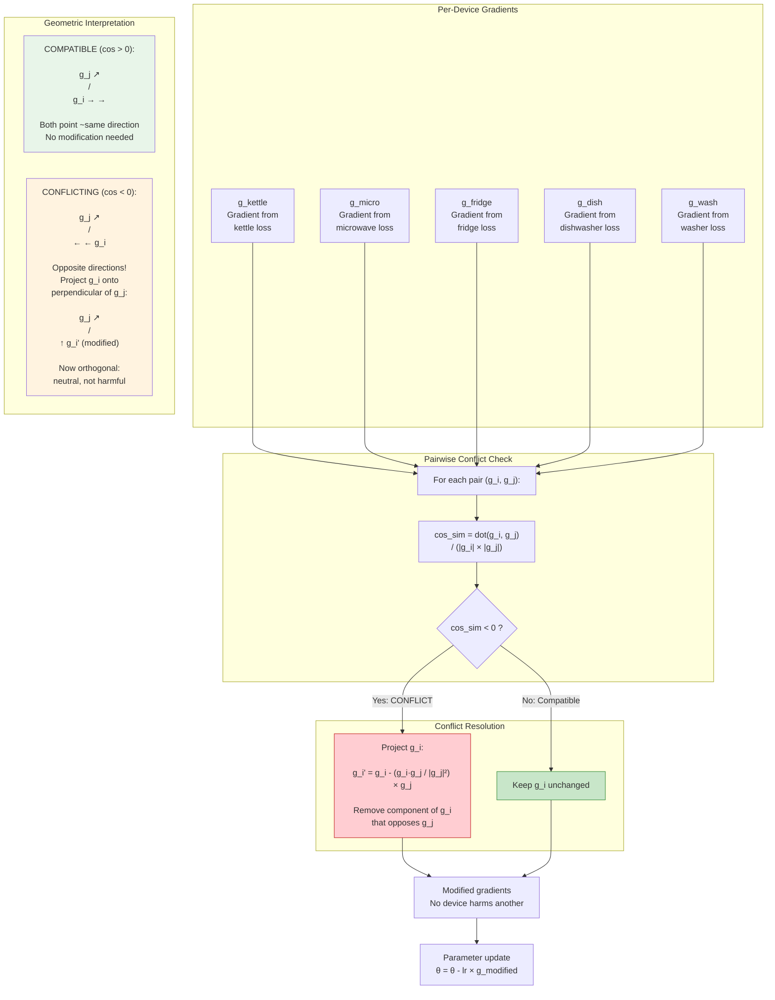

# Mermaid Diagram 6: Training Pipeline

> This diagram shows the complete training loop including multi-crop strategy, forward pass, 7-component loss, and gradient conflict resolution.

## Diagram: Training Loop



## Diagram: Device-Type Specific Loss Parameters



## Diagram: PCGrad Gradient Conflict Resolution



## Loss Component Explanation Table

```
COMPONENT    FORMULA                          WEIGHT RANGE    PURPOSE
─────────    ──────────────────────────────── ────────────    ──────────────────────
MAE_ON       mean(|pred - target|, ON only)   α_on: 0.8-3.8  Accurate ON prediction
MAE_OFF      mean(|pred - 0|, OFF only)       α_off: 0.1-0.6 Suppress false positives
Peak         |max(pred) - max(target)|        w_peak: 0.15-0.25  Peak power accuracy
Gradient     mean(|Δpred - Δtarget|)          w_grad: 0.08-0.15  Transition timing
Energy       |Σpred - Σtarget| / L            w_energy: 0.20-0.32 Energy conservation
Zero         penalty for pred>0 during OFF    λ_zero: 0.03-0.10   Clean OFF state
OFF Hard     penalty for spikes in long OFF   λ_off: varies        Extended OFF clean

Gate         BCE(gate_prob, true_state)       1.0             ON/OFF classification
```

## Training Schedule

```
Epoch:    0        warmup_end                              max_epochs
          |============|========================================|
          |            |                                        |

Multi-crop:  DISABLED         ENABLED (k=2-4 crops, event-biased)
Anti-collapse: 1.0     ────────────────────────────────>    0.2
Output stats:  0.0  ──> 1.0                                 1.0
Learning rate: initial  ──> warmup ──> cosine decay ──>    min_lr
```
