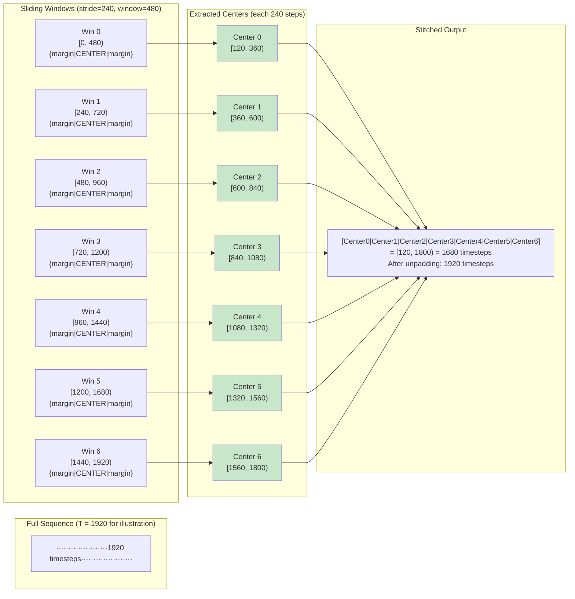
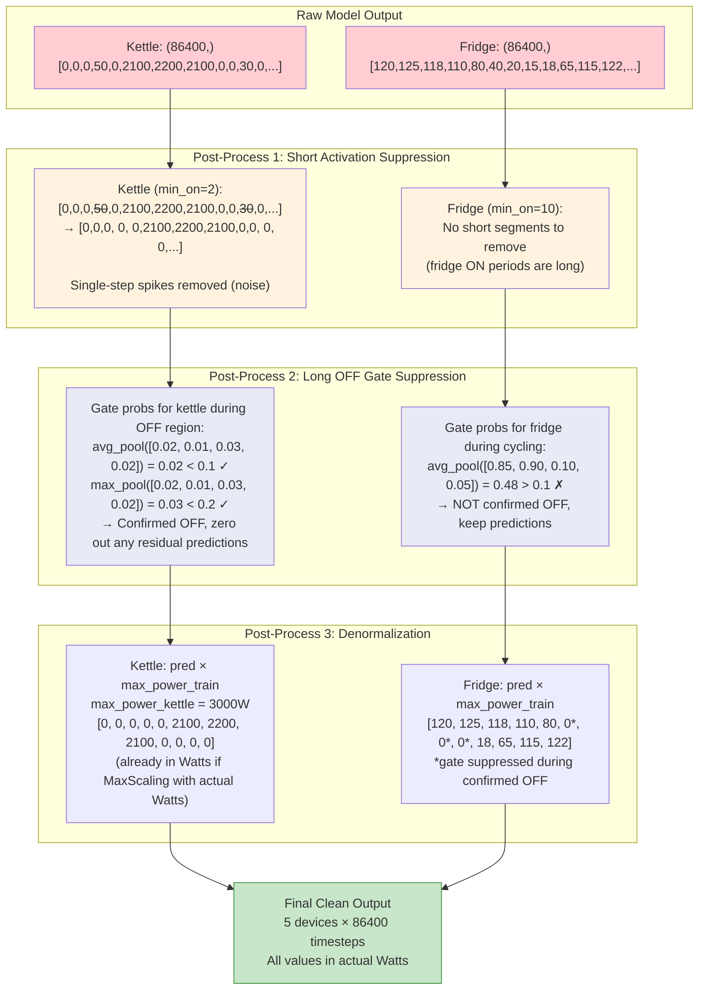

# Mermaid Diagram 7: Inference & Post-Processing Pipeline

> This diagram shows the complete inference pipeline from full test sequence to final per-device power predictions in Watts.

## Diagram: Seq2Subseq Sliding Window Inference

```mermaid
graph TD
    subgraph INPUT["Full Test Sequence"]
        FULL["Input: (1, 7, T)<br/>T = 86,400 timesteps<br/>(24 hours at 1-min resolution)<br/>7 = 1 power + 6 temporal"]
    end

    subgraph PAD["Step 1: Padding"]
        FULL --> PAD_OP["Pad for stride alignment<br/><br/>window_size = 480<br/>output_ratio = 0.5<br/>center_size = 480 × 0.5 = 240<br/>stride = 240<br/>margin = (480 - 240) / 2 = 120<br/><br/>pad_left = 120<br/>pad_right = 120 + alignment"]
        PAD_OP --> PADDED["Padded: (1, 7, T_padded)<br/>T_padded = T + 240 + alignment"]
    end

    subgraph SLIDE["Step 2: Create Sliding Windows"]
        PADDED --> WIN_CREATE["Sliding window extraction<br/><br/>Window 0:   [0, 480)<br/>Window 1:   [240, 720)<br/>Window 2:   [480, 960)<br/>Window 3:   [720, 1200)<br/>...<br/>Window N-1: [T_padded-480, T_padded)<br/><br/>N = T_padded / stride = ~360 windows"]
        WIN_CREATE --> WINDOWS["All windows stacked<br/>(N, 7, 480)<br/>N ≈ 360"]
    end

    subgraph BATCH_INF["Step 3: Batch Inference"]
        WINDOWS --> BATCH_SPLIT["Split into batches<br/>batch_size = 32<br/>~12 batches"]
        BATCH_SPLIT --> MODEL_FWD["NILMFormer forward<br/>Input: (32, 7, 480)<br/>Output: (32, 5, 480)<br/><br/>Repeated for each batch"]
        MODEL_FWD --> ALL_OUT["All window outputs<br/>(N, 5, 480)"]
    end

    subgraph CENTER["Step 4: Extract Centers"]
        ALL_OUT --> CTR_EXTRACT["For each window output (5, 480):<br/><br/>Discard left margin: [0, 120)<br/>KEEP center:        [120, 360)<br/>Discard right margin: [360, 480)<br/><br/>Center: (5, 240) per window"]

        CTR_EXTRACT --> CTR_VIZ["Visual:<br/><br/>Win 0: |--discard--|====center====|--discard--|<br/>Win 1: ·············|--discard--|====center====|--discard--|<br/>Win 2: ··························|--discard--|====center====|--discard--|<br/><br/>Centers tile perfectly!<br/>No gaps, no overlap"]
    end

    subgraph STITCH["Step 5: Stitch & Unpad"]
        CTR_VIZ --> CONCAT["Concatenate all centers<br/>along time dimension<br/>(5, N × 240)"]
        CONCAT --> UNPAD["Remove padding<br/>(5, T_original)<br/>= (5, 86400)"]
    end

    subgraph POST["Step 6: Post-Processing"]
        UNPAD --> PP1["6a. Short Activation Suppression<br/><br/>For each device:<br/>  Find ON segments (power > thresh)<br/>  If segment < min_on_steps: set to 0<br/><br/>  Kettle: min_on = 2 steps<br/>  Fridge: min_on = 10 steps<br/>  Washer: min_on = 5 steps"]

        PP1 --> PP2["6b. Long OFF Gate Suppression<br/><br/>Use gate probabilities:<br/>  avg_pool(gate, k=window) → avg_gate<br/>  max_pool(gate, k=window) → max_gate<br/><br/>  If avg_gate < 0.1 AND max_gate < 0.2:<br/>    Confirmed OFF → set power = 0<br/><br/>Removes false activations in<br/>genuine OFF periods"]

        PP2 --> PP3["6c. Denormalization<br/><br/>Reverse MaxScaling:<br/>  power_watts = pred × max_power_train<br/><br/>Convert back to actual Watts"]
    end

    PP3 --> FINAL["Final Output<br/>(5, 86400)<br/>5 appliance power curves<br/>in actual Watts<br/>86,400 timesteps = 24 hours"]

    %% Styling
    style FULL fill:#e1f5fe,stroke:#0288d1
    style FINAL fill:#c8e6c9,stroke:#388e3c
    style PP1 fill:#fff3e0,stroke:#f57c00
    style PP2 fill:#fce4ec,stroke:#c2185b
    style PP3 fill:#e8f5e9,stroke:#2e7d32
```



## Diagram: Sliding Window Detail



## Diagram: Post-Processing Pipeline



## Inference Computation Cost

```
For 24-hour test sequence (T=86,400 at 1-min resolution):

Sliding windows:
    N = ceil(86400 / 240) = 360 windows
    Each window: (1, 7, 480) → model → (1, 5, 480)
    Total forward passes: 360 / 32 batch_size = ~12 batches

Per-batch computation:
    Dilated Conv:  32 × 7 × 480 × 8 × 3 × 4 = ~1.3M FLOPs
    Attention:     32 × 8 × 480 × 480 × 12 = ~707M FLOPs (dominant!)
    FFN:           32 × 480 × 96 × 384 × 2 = ~1.1B FLOPs
    Device heads:  32 × 96 × 480 × 128 × 5 = ~0.9B FLOPs
    Total per batch: ~3B FLOPs

Total inference: 12 batches × 3B = ~36 GFLOPS
    On modern GPU: < 1 second for 24 hours of data
    On CPU: ~5-10 seconds
```

## Visualization Suggestions

```
1. SLIDING WINDOW ANIMATION:
   - Full 24h signal on top (compressed)
   - Animated window sweeping left to right
   - Current window expanded below showing full detail
   - Center region highlighted in green
   - Margin regions in gray
   - Stitched output building up on bottom

2. POST-PROCESSING LAYERS:
   - Raw output signal
   - After suppression: removed segments flash red then disappear
   - After gate: suppressed regions flash blue then zero out
   - After denorm: y-axis labels change from normalized to Watts

3. FINAL DISAGGREGATION:
   - Top: aggregate signal (input)
   - Below: 5 stacked device signals (output)
   - All aligned on same time axis
   - Hover to see exact Watts at any timepoint
   - Sum of 5 devices approximately equals aggregate (conservation check)
```
