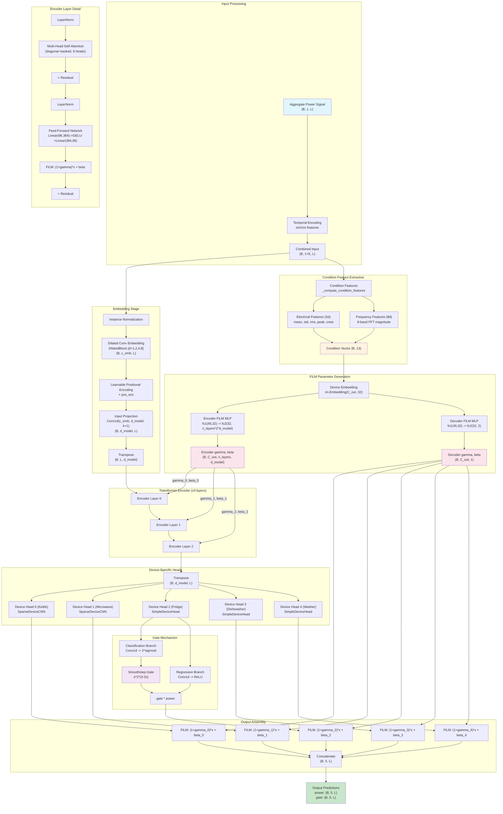
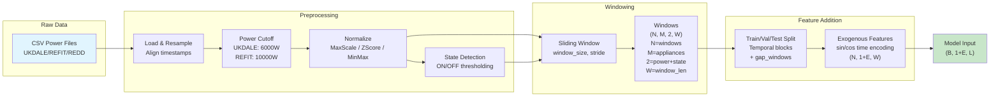
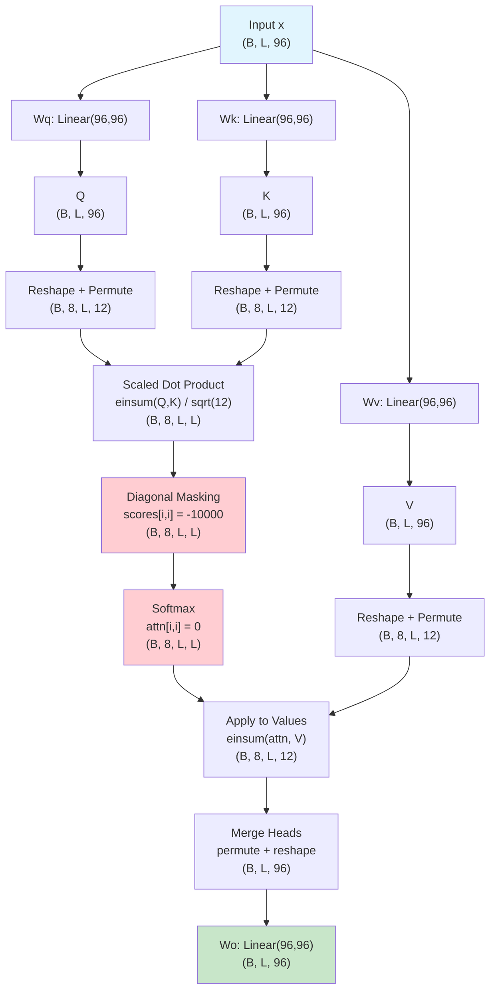
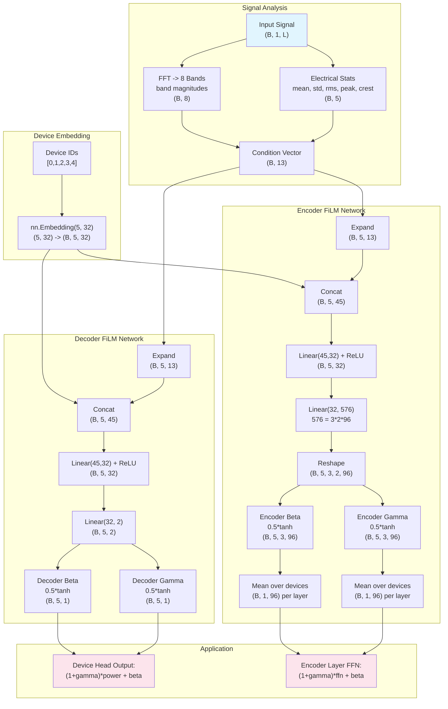
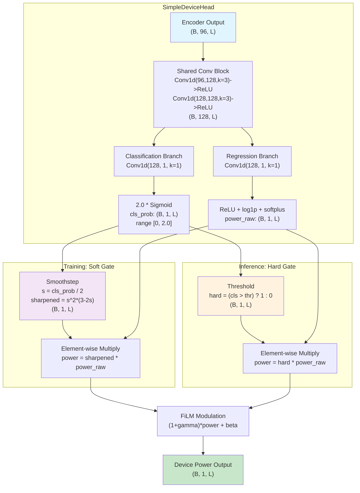
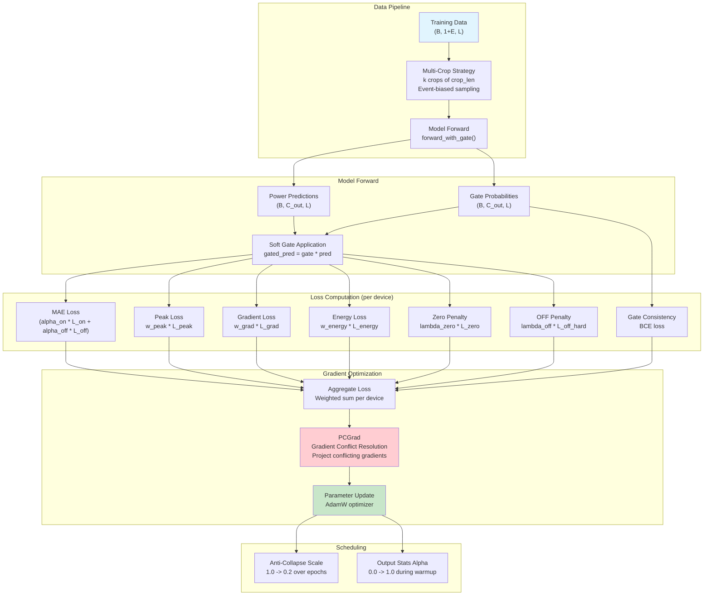

# CondiNILM / NILMFormer Architecture Visualization Specification

> This document provides a complete architectural specification for generating an interactive WebGL visualization of the CondiNILM system. It covers every stage from raw power waveform input to final per-device power predictions, with exact tensor shapes, computation details, and data flow descriptions.

---

## Table of Contents

1. [System Overview](#1-system-overview)
2. [Data Preprocessing Pipeline](#2-data-preprocessing-pipeline)
3. [Feature Engineering](#3-feature-engineering)
4. [NILMFormer Network Architecture](#4-nilmformer-network-architecture)
5. [Dilated Convolution Embedding](#5-dilated-convolution-embedding)
6. [Transformer Encoder with FiLM](#6-transformer-encoder-with-film)
7. [Multi-Head Self-Attention (Diagonal Masking)](#7-multi-head-self-attention-diagonal-masking)
8. [FiLM Modulation Mechanism](#8-film-modulation-mechanism)
9. [Device-Specific Heads & Gate Mechanism](#9-device-specific-heads--gate-mechanism)
10. [Training Pipeline & Loss Functions](#10-training-pipeline--loss-functions)
11. [Inference & Post-Processing](#11-inference--post-processing)
12. [Concrete Example with Numbers](#12-concrete-example-with-numbers)
13. [Mermaid Diagrams](#13-mermaid-diagrams)

---

## 1. System Overview

**CondiNILM** (Conditional Non-Intrusive Load Monitoring) is a Transformer-based neural network that disaggregates a household's total power signal into individual appliance power consumption. The core model is called **NILMFormer**.

### Key Design Principles
- **Encoder-only Transformer** (no decoder) with diagonal-masked self-attention
- **FiLM conditioning** (Feature-wise Linear Modulation) for device-specific adaptation
- **Multi-task learning**: simultaneous power regression + ON/OFF gate classification
- **CNN bypass** for sparse two-state devices (kettle, microwave)
- **Gradient conflict resolution** via PCGrad for multi-device training

### High-Level Data Flow

```
Household Aggregate Power (1D time series)
    --> Sliding Window + Temporal Encoding
    --> Dilated Conv Embedding
    --> Transformer Encoder (x3 layers, with FiLM)
    --> Per-Device Heads (power + gate)
    --> Individual Appliance Power Predictions
```

---

## 2. Data Preprocessing Pipeline

### 2.1 Raw Data Loading

**Source**: CSV files from UKDALE / REFIT / REDD datasets
**Code**: `src/helpers/preprocessing.py:449-1983`

| Dataset | Power Cutoff | Sampling Rate |
|---------|-------------|---------------|
| UKDALE  | 6000W       | 6s (resampled) |
| REFIT   | 10000W      | 8s             |
| REDD    | varies      | 1s-3s          |

### 2.2 Normalization Strategies

**Code**: `src/helpers/dataset.py`

| Strategy | Formula | Use Case |
|----------|---------|----------|
| MaxScaling | x / max(x) | Default |
| StandardScaling | (x - mean) / std | Z-score |
| MinMax | (x - min) / (max - min) | Bounded [0,1] |
| MeanScaling | x / mean(x) | Mean-centered |

### 2.3 Sliding Window Creation

**Code**: `src/helpers/preprocessing.py:226-433`

```
Raw power series: shape (T_total,)
    |
    v  [sliding window with stride]
Windows: shape (N_windows, M_appliances, 2, Window_Length)
    - N_windows: number of overlapping windows
    - M_appliances: number of target appliances
    - 2: channels [power_value, on_off_state]
    - Window_Length: e.g., 480 (8 hours @ 1-min), 1440 (24 hours)
```

### 2.4 Temporal Block Splitting

**Code**: `src/helpers/preprocessing.py:226-333`

- Uses `gap_windows` to prevent temporal leakage between train/val/test
- Ensures no window spans a split boundary

---

## 3. Feature Engineering

### 3.1 Exogenous Temporal Features

**Code**: `src/helpers/preprocessing.py:349-433` (create_exogene)

Cyclical sin/cos encoding of time variables:

```
For each timestamp t:
    month_sin  = sin(2pi * month / 12)
    month_cos  = cos(2pi * month / 12)
    day_sin    = sin(2pi * day_of_year / 365)
    day_cos    = cos(2pi * day_of_year / 365)
    hour_sin   = sin(2pi * hour / 24)
    hour_cos   = cos(2pi * hour / 24)
    ...
```

**Tensor shape after adding exogenous features**:
```
Input to model: (B, 1 + n_exo*2, L)
    - B: batch size (e.g., 32)
    - 1: aggregate power channel
    - n_exo*2: sin/cos pairs (e.g., 6 = 3 features x 2)
    - L: sequence length (e.g., 480)

Example: (32, 7, 480)  -->  1 power + 6 temporal encodings, 480 timesteps
```

### 3.2 Condition Features (Computed Inside Model)

**Code**: `src/nilmformer/model.py:413-454` (_compute_condition_features)

These are computed from the input signal during forward pass, NOT during preprocessing:

#### Electrical Features (5 dimensions)
```python
mean  = x.mean(dim=-1)                        # Average power
std   = x.std(dim=-1, unbiased=False)          # Power variability
rms   = sqrt(x.pow(2).mean(dim=-1) + 1e-6)    # Root mean square
peak  = x.abs().amax(dim=-1)                   # Peak power
crest = peak / (rms + 1e-6)                    # Crest factor (peakiness)
```

#### Frequency Features (8 dimensions)
```python
x_centered = x - x.mean(dim=-1, keepdim=True)   # Remove DC component
spec = torch.fft.rfft(x_centered, dim=-1)        # Real FFT
mag = spec.abs()                                  # Magnitude spectrum
# Split into 8 frequency bands, compute mean magnitude per band
band_feats = [mag[:, start:end].mean(dim=-1) for each of 8 bands]
```

#### Combined Condition Vector
```
condition_features: (B, 13)
    - 5 electrical features + 8 frequency band features
```

---

## 4. NILMFormer Network Architecture

### 4.1 Configuration Defaults

**Code**: `src/nilmformer/config.py`

```python
@dataclass
class NILMFormerConfig:
    c_in: int = 1              # Input channels
    c_embedding: int = 8       # Dilated conv output channels
    c_out: int = 5             # Number of target appliances
    kernel_size: int = 3       # Conv kernel size
    dilations: List = [1,2,4,8]  # Dilation rates
    n_encoder_layers: int = 3  # Transformer layers
    d_model: int = 96          # Transformer hidden dim
    n_head: int = 8            # Attention heads
    head_dim: int = 12         # Per-head dimension (96/8)
    pffn_ratio: int = 4        # FFN expansion ratio
    dp_rate: float = 0.2       # Dropout rate
    mask_diagonal: bool = True # Diagonal mask in attention
    use_film: bool = True      # FiLM modulation
    film_hidden_dim: int = 32  # FiLM network width
    use_freq_features: bool = True
    use_elec_features: bool = True
```

### 4.2 Complete Forward Pass Tensor Flow

Below is the **exact tensor shape at every stage** (using B=32, C_out=5, L=480):

```
Stage 0: INPUT
    x: (32, 7, 480)            -- [batch, 1+6_exo, seq_len]

Stage 1: INSTANCE NORMALIZATION
    x = (x - mean) / (std + 1e-5)
    x: (32, 7, 480)            -- same shape, normalized per-sample

Stage 2: DILATED CONV EMBEDDING (DilatedBlock)
    Input:  (32, 7, 480)       -- [batch, c_in+exo, L]
    ResUnit(dil=1): Conv1d(7, 8, k=3, dil=1) -> GELU -> BN
    ResUnit(dil=2): Conv1d(8, 8, k=3, dil=2) -> GELU -> BN
    ResUnit(dil=4): Conv1d(8, 8, k=3, dil=4) -> GELU -> BN
    ResUnit(dil=8): Conv1d(8, 8, k=3, dil=8) -> GELU -> BN
    Output: (32, 8, 480)       -- [batch, c_embedding, L]

Stage 3: POSITIONAL ENCODING (learnable)
    pos_encoding: (1, 8, 480)  -- learnable parameter
    x = x + pos_encoding
    x: (32, 8, 480)

Stage 4: INPUT PROJECTION
    Conv1d(8, 96, kernel_size=1)
    Input:  (32, 8, 480)
    Output: (32, 96, 480)      -- [batch, d_model, L]

Stage 5: TRANSPOSE for Transformer
    x = x.transpose(1, 2)
    x: (32, 480, 96)           -- [batch, L, d_model]

Stage 6: COMPUTE ENCODER FiLM PARAMETERS
    condition_features: (32, 13)     -- from _compute_condition_features
    device_embed: (5, 32)            -- nn.Embedding(5, 32)
    --> expand to (32, 5, 32)
    concat with cond: (32, 5, 45)    -- [13 + 32]
    fc1(45->32) + ReLU: (32, 5, 32)
    fc2(32->1152): (32, 5, 1152)     -- 1152 = 3_layers * 2 * 96
    reshape: (32, 5, 3, 2, 96)
    gamma: (32, 5, 3, 96)            -- per-device, per-layer scale
    beta:  (32, 5, 3, 96)            -- per-device, per-layer shift
    average over devices: gamma_l: (32, 1, 96), beta_l: (32, 1, 96)

Stage 7: TRANSFORMER ENCODER (x3 layers)
    For each layer l in [0, 1, 2]:

    7a. LayerNorm
        x: (32, 480, 96)

    7b. Diagonally Masked Multi-Head Self-Attention
        Q = Wq(x): (32, 480, 96) -> reshape (32, 8, 480, 12)
        K = Wk(x): (32, 480, 96) -> reshape (32, 8, 480, 12)
        V = Wv(x): (32, 480, 96) -> reshape (32, 8, 480, 12)
        scores = einsum(Q, K) * scale: (32, 8, 480, 480)
        diagonal_mask: eye(480) -> fill -1e4 on diagonal
        attn = softmax(scores): (32, 8, 480, 480)
        attn[diagonal] = 0.0
        output = einsum(attn, V): (32, 8, 480, 12)
        reshape: (32, 480, 96)
        Wo projection: (32, 480, 96)

    7c. Residual: x = x + attn_output
        x: (32, 480, 96)

    7d. LayerNorm
        x: (32, 480, 96)

    7e. Position-wise Feed-Forward Network
        Linear(96, 384) -> GELU -> Dropout -> Linear(384, 96)
        hidden: (32, 480, 384)   -- expansion ratio 4x
        output: (32, 480, 96)

    7f. FiLM MODULATION (per-layer)
        gamma_l = avg_over_devices(gamma[:,:,l,:]): (32, 1, 96)
        beta_l  = avg_over_devices(beta[:,:,l,:]):  (32, 1, 96)
        ffn_out = (1.0 + gamma_l) * ffn_out + beta_l
        ffn_out: (32, 480, 96)

    7g. Residual: x = x + ffn_out
        x: (32, 480, 96)

Stage 8: COMPUTE OUTPUT FiLM PARAMETERS
    condition_features: (32, 13)
    device_embed: (32, 5, 32)
    concat: (32, 5, 45)
    fc1 + ReLU: (32, 5, 32)
    fc2: (32, 5, 2)
    gamma = 0.5 * tanh(gb[...,0:1]): (32, 5, 1)  -- range [-0.5, 0.5]
    beta  = 0.5 * tanh(gb[...,1:2]): (32, 5, 1)

Stage 9: TRANSPOSE BACK
    x = x.transpose(1, 2)
    x: (32, 96, 480)           -- [batch, d_model, L]

Stage 10: DEVICE-SPECIFIC HEADS (x5 devices)
    For each device i in [0..4]:

    CASE A: Regular Device (SimpleDeviceHead)
        Shared features:
            Conv1d(96, 128, k=3, pad=1) -> ReLU -> Conv1d(128, 128, k=3, pad=1) -> ReLU
            features: (32, 128, 480)
        Classification branch:
            Conv1d(128, 1, k=1) -> 2.0 * sigmoid
            cls_prob: (32, 1, 480)       -- range [0, 2.0]
        Regression branch:
            Conv1d(128, 1, k=1) -> ReLU -> log1p -> softplus_amplitude
            power_raw: (32, 1, 480)
        Soft gate (training):
            sharpened = cls^2 * (3 - 2*cls)   -- smoothstep
            power = sharpened * power_raw
            output: (32, 1, 480)
        Hard gate (inference):
            hard_gate = (cls_prob > threshold).float()
            power = hard_gate * power_raw

    CASE B: Sparse Device (SparseDeviceCNN, e.g., kettle/microwave)
        Dilated Conv stack on raw input
        output: (32, 2, 480)             -- [power, gate_logit]

    OUTPUT FiLM MODULATION:
        power_i = (1.0 + gamma[i]) * power_i + beta[i]

Stage 11: CONCATENATE ALL DEVICES
    output = cat([dev_0, dev_1, ..., dev_4], dim=1)
    output: (32, 5, 480)         -- [batch, n_devices, L]

Stage 12: FINAL OUTPUT
    predictions: (32, 5, 480)    -- per-device power predictions
    gate_probs:  (32, 5, 480)    -- per-device ON/OFF probabilities
```

---

## 5. Dilated Convolution Embedding

**Code**: `src/nilmformer/layers/embedding.py:9-74`

### Architecture

```
Input: (B, C_in, L) = (32, 7, 480)
    |
    v  ResUnit(c_in=7, c_out=8, dilation=1)
    |  Conv1d(7, 8, k=3, d=1, pad=1) -> GELU -> BatchNorm1d(8)
    |  + residual (1x1 conv to match channels: 7->8)
    |  receptive field: 3
    v
    (32, 8, 480)
    |
    v  ResUnit(c_in=8, c_out=8, dilation=2)
    |  Conv1d(8, 8, k=3, d=2, pad=2) -> GELU -> BatchNorm1d(8)
    |  + residual (identity, channels match)
    |  receptive field: 3 + 4 = 7
    v
    (32, 8, 480)
    |
    v  ResUnit(c_in=8, c_out=8, dilation=4)
    |  Conv1d(8, 8, k=3, d=4, pad=4) -> GELU -> BatchNorm1d(8)
    |  + residual (identity)
    |  receptive field: 7 + 8 = 15
    v
    (32, 8, 480)
    |
    v  ResUnit(c_in=8, c_out=8, dilation=8)
    |  Conv1d(8, 8, k=3, d=8, pad=8) -> GELU -> BatchNorm1d(8)
    |  + residual (identity)
    |  receptive field: 15 + 16 = 31
    v
Output: (32, 8, 480)
```

**Total receptive field**: 31 time steps from 4 dilated layers

---

## 6. Transformer Encoder with FiLM

**Code**: `src/nilmformer/layers/transformer.py:100-140`

### Single Encoder Layer

```
Input x: (B, L, d_model) = (32, 480, 96)
    |
    v  LayerNorm(96)
    |
    v  DiagonallyMaskedSelfAttention
    |    Q,K,V projections -> multi-head attention
    |    output: (32, 480, 96)
    |
    +--- Residual connection
    |
    v  x: (32, 480, 96)
    |
    v  LayerNorm(96)
    |
    v  PositionWiseFeedForward
    |    Linear(96, 384) -> GELU -> Dropout(0.2) -> Linear(384, 96)
    |    output: (32, 480, 96)
    |
    v  FiLM Modulation (if enabled)
    |    ffn_out = (1 + gamma) * ffn_out + beta
    |    gamma, beta: (32, 1, 96) -- averaged over devices
    |
    +--- Residual connection
    |
    v  Output: (32, 480, 96)
```

### Stack of 3 Encoder Layers

```
Layer 0: x -> attention -> FFN + FiLM(gamma_0, beta_0) -> x
Layer 1: x -> attention -> FFN + FiLM(gamma_1, beta_1) -> x
Layer 2: x -> attention -> FFN + FiLM(gamma_2, beta_2) -> x
```

---

## 7. Multi-Head Self-Attention (Diagonal Masking)

**Code**: `src/nilmformer/layers/transformer.py:14-76`

### Architecture Details

```
n_heads = 8, head_dim = 12, d_model = 96 (= 8 x 12)

Input x: (B, L, d_model) = (32, 480, 96)

Step 1: Linear Projections
    Wq: Linear(96, 96, bias=False)  ->  Q: (32, 480, 96)
    Wk: Linear(96, 96, bias=False)  ->  K: (32, 480, 96)
    Wv: Linear(96, 96, bias=False)  ->  V: (32, 480, 96)

Step 2: Reshape to Multi-Head
    Q: (32, 480, 96) -> view(32, 480, 8, 12) -> permute(0,2,1,3) -> (32, 8, 480, 12)
    K: (32, 480, 96) -> view(32, 480, 8, 12) -> permute(0,2,1,3) -> (32, 8, 480, 12)
    V: (32, 480, 96) -> view(32, 480, 8, 12) -> permute(0,2,1,3) -> (32, 8, 480, 12)

Step 3: Scaled Dot-Product Attention
    scores = einsum("bhle,bhse->bhls", Q, K)
    scores: (32, 8, 480, 480)
    scores = scores * (12 ** -0.5)    -- scale factor = 1/sqrt(head_dim)

Step 4: Diagonal Masking (KEY INNOVATION)
    diag_mask = eye(480).bool()       -- shape (480, 480)
    diag_mask = diag_mask.unsqueeze(0).unsqueeze(0)  -- (1, 1, 480, 480)
    scores.masked_fill_(diag_mask, -1e4)

    Purpose: Prevents each timestep from attending to itself.
    This forces the model to use CONTEXT rather than copying input.
    Critical for NILM where input = aggregate, output = disaggregated.

Step 5: Softmax
    attn = softmax(scores, dim=-1)    -- (32, 8, 480, 480)
    attn.masked_fill_(diag_mask, 0.0) -- zero out diagonal after softmax

Step 6: Weighted Sum of Values
    output = einsum("bhls,bhsd->bhld", attn, V)
    output: (32, 8, 480, 12)

Step 7: Merge Heads
    output = output.permute(0, 2, 1, 3)  -- (32, 480, 8, 12)
    output = output.reshape(32, 480, 96)

Step 8: Output Projection
    Wo: Linear(96, 96, bias=False)
    output: (32, 480, 96)
```

### Attention Matrix Visualization

```
For sequence length L=8 (simplified):

BEFORE diagonal masking:       AFTER diagonal masking:
    t0  t1  t2  t3  ...          t0  t1  t2  t3  ...
t0 [.3  .2  .1  .1  ...]    t0 [-inf .2  .1  .1  ...]
t1 [.1  .4  .2  .1  ...]    t1 [.1  -inf .2  .1  ...]
t2 [.1  .2  .3  .2  ...]    t2 [.1  .2  -inf .2  ...]
t3 [.1  .1  .2  .4  ...]    t3 [.1  .1  .2  -inf ...]
...                           ...

After softmax:  diagonal entries become 0,
remaining entries are renormalized to sum to 1.
```

---

## 8. FiLM Modulation Mechanism

**Code**: `src/nilmformer/model.py:312-329, 456-518`

### 8.1 Overview

FiLM (Feature-wise Linear Modulation) applies an **affine transformation** conditioned on device identity and signal statistics:

```
output = (1 + gamma) * input + beta
```

There are **two FiLM systems**:
1. **Encoder FiLM**: Modulates each transformer layer's FFN output (per-layer, per-device)
2. **Decoder FiLM**: Modulates each device head's final power output (per-device)

### 8.2 Condition Feature Extraction

```
Input Signal x_main: (B, 1, L) = (32, 1, 480)
    |
    +---> ELECTRICAL FEATURES (5 dims)
    |     mean:  mean(x)           -- avg power level
    |     std:   std(x)            -- power variability
    |     rms:   sqrt(mean(x^2))   -- effective power
    |     peak:  max(|x|)          -- peak power
    |     crest: peak / rms        -- peakiness ratio
    |     Shape: (32, 5)
    |
    +---> FREQUENCY FEATURES (8 dims)
    |     x_centered = x - mean(x)
    |     spectrum = rfft(x_centered)   -- Real FFT
    |     magnitude = |spectrum|         -- (32, L//2+1)
    |     Split into 8 equal frequency bands
    |     Per-band mean magnitude
    |     Shape: (32, 8)
    |
    v  CONCATENATE
    condition: (32, 13)            -- [5 elec + 8 freq]
```

### 8.3 Encoder FiLM Parameter Generation

```
condition: (32, 13)
device_ids: [0, 1, 2, 3, 4]

Step 1: Device Embedding
    encoder_device_embed: nn.Embedding(5, 32)
    dev_emb: (5, 32) -> expand -> (32, 5, 32)

Step 2: Condition Expansion
    cond_exp: (32, 13) -> unsqueeze(1) -> expand -> (32, 5, 13)

Step 3: Concatenate
    inp = cat([cond_exp, dev_emb], dim=-1)
    inp: (32, 5, 45)                -- [13 condition + 32 embedding]

Step 4: MLP
    encoder_film_fc1: Linear(45, 32) + ReLU
    h: (32, 5, 32)

    encoder_film_fc2: Linear(32, 1152)    -- 1152 = 3 layers x 2 x 96
    gb: (32, 5, 1152)

Step 5: Reshape
    gb: (32, 5, 1152) -> view(32, 5, 3, 2, 96)
    gamma_raw = gb[:,:,:,0,:]: (32, 5, 3, 96)   -- per-device, per-layer
    beta_raw  = gb[:,:,:,1,:]: (32, 5, 3, 96)

Step 6: Activation & Scaling
    gamma = 0.5 * tanh(gamma_raw): (32, 5, 3, 96)  -- range [-0.5, 0.5]
    beta  = 0.5 * tanh(beta_raw):  (32, 5, 3, 96)

Step 7: Average Over Devices (for shared encoder)
    gamma_l = gamma[:,:,l,:].mean(dim=1): (32, 96) -> unsqueeze(1) -> (32, 1, 96)
    beta_l  = beta[:,:,l,:].mean(dim=1):  (32, 96) -> unsqueeze(1) -> (32, 1, 96)

Application in Encoder Layer l:
    ffn_output = (1.0 + gamma_l) * ffn_output + beta_l
    Scale range: [0.5, 1.5] (since gamma in [-0.5, 0.5])
```

### 8.4 Decoder FiLM Parameter Generation

```
condition: (32, 13)

Step 1-3: Same as encoder (device embed + condition concat)
    inp: (32, 5, 45)

Step 4: MLP (different network)
    film_fc1: Linear(45, 32) + ReLU -> (32, 5, 32)
    film_fc2: Linear(32, 2)         -> (32, 5, 2)

Step 5: Split & Scale
    gamma = 0.5 * tanh(gb[..., 0:1]): (32, 5, 1)
    beta  = 0.5 * tanh(gb[..., 1:2]): (32, 5, 1)

Application per Device Head i:
    power_i = (1.0 + gamma[:,i,:]) * power_i + beta[:,i,:]
```

### 8.5 FiLM Effect Visualization

```
Without FiLM:   All devices share the same feature transformation
With FiLM:      Each device gets adaptive scaling and shifting

Example for Kettle (high-power, sparse):
    gamma = +0.4  ->  scale = 1.4x  (amplify features)
    beta  = +0.3  ->  shift features upward

Example for Fridge (low-power, always-on):
    gamma = -0.3  ->  scale = 0.7x  (suppress features)
    beta  = -0.1  ->  shift features downward
```

---

## 9. Device-Specific Heads & Gate Mechanism

**Code**: `src/nilmformer/model.py:15-175`

### 9.1 SimpleDeviceHead (Regular Devices)

```
Input from Encoder: (B, d_model, L) = (32, 96, 480)
    |
    v  SHARED FEATURE EXTRACTION
    |  Conv1d(96, 128, k=3, pad=1) -> ReLU
    |  Conv1d(128, 128, k=3, pad=1) -> ReLU
    |  features: (32, 128, 480)
    |
    +---> CLASSIFICATION BRANCH (Gate)
    |     Conv1d(128, 1, k=1)
    |     logits: (32, 1, 480)
    |     cls_prob = 2.0 * sigmoid(logits): (32, 1, 480)   -- range [0, 2.0]
    |
    +---> REGRESSION BRANCH (Power)
    |     Conv1d(128, 1, k=1)
    |     raw: (32, 1, 480)
    |     power_raw = relu(raw): (32, 1, 480)              -- non-negative
    |     (with log1p and softplus amplitude scaling)
    |
    v  GATE APPLICATION
    |
    |  Training (Soft Gate - Smoothstep):
    |      sharpened = cls_prob^2 * (3 - 2 * cls_prob)     -- S-curve
    |      power = sharpened * power_raw
    |      power: (32, 1, 480)
    |
    |  Inference (Hard Gate - Threshold):
    |      hard_gate = (cls_prob > threshold).float()       -- binary {0, 1}
    |      power = hard_gate * power_raw
    |      power: (32, 1, 480)
    |
    v  Output: (32, 1, 480) for power, (32, 1, 480) for gate_logits
```

### 9.2 SparseDeviceCNN (Kettle, Microwave)

```
Input from Encoder: (B, d_model, L) = (32, 96, 480)
    |
    v  Dilated Conv Stack (bypasses transformer for efficiency)
    |  Conv1d(96, 64, k=3, d=1) -> GELU -> BN
    |  Conv1d(64, 64, k=3, d=2) -> GELU -> BN
    |  Conv1d(64, 2, k=1)                        -- 2 channels: power + gate
    |
    v  Output: (32, 2, 480)
    |    channel 0: power prediction
    |    channel 1: gate logits
```

### 9.3 Gate Mechanism - Smoothstep Function

```
The smoothstep function s(x) = x^2 * (3 - 2x) provides:
- Smooth gradient flow (differentiable everywhere)
- Sharper transitions than sigmoid near 0 and 1
- Natural saturation at boundaries

    1.0 |          ___________
        |         /
        |        /
        |       /     <-- smooth S-curve
        |      /
        |_____/
    0.0 +------------------------
        0.0   0.5    1.0

Compared to hard threshold (step function):
- Allows gradient-based learning of ON/OFF boundary
- Converges to near-binary decisions after training
```

### 9.4 Gate Integration in Multi-Task Output

```
For each of 5 devices:
    power_pred[i]: (32, 1, 480)     -- regression output
    gate_prob[i]:  (32, 1, 480)     -- classification probability

    # Soft gating during training
    gated_power[i] = gate_prob[i] * power_pred[i]

    # FiLM modulation on top
    final_power[i] = (1 + gamma[i]) * gated_power[i] + beta[i]

Concatenate all:
    final_output: (32, 5, 480)      -- all devices stacked
```

---

## 10. Training Pipeline & Loss Functions

### 10.1 Multi-Task Adaptive Loss

**Code**: `src/helpers/loss.py`, `src/helpers/device_config.py`

7 loss components per device, each with learnable/configured weights:

```
L_total = sum over all devices of:
    alpha_on  * L_mae_on      -- MAE on ON-state samples (power > 0)
  + alpha_off * L_mae_off     -- MAE on OFF-state samples (power = 0)
  + w_peak    * L_peak        -- Penalize peak power errors
  + w_grad    * L_gradient    -- Penalize energy change errors
  + w_energy  * L_energy      -- Penalize total energy errors
  + lambda_zero * L_zero      -- Penalize non-zero predictions during OFF
  + lambda_off  * L_off_hard  -- Penalize false activations in long OFF periods
```

### 10.2 Device Type Classification

```
Based on electrical statistics:
    duty_cycle: ON_time / total_time
    peak_power: max power draw
    mean_on_duration: average ON segment length
    cv_on: coefficient of variation of ON durations

Classification tree:
    duty < 0.03 AND peak > 2000W  -> sparse_high_power (kettle, microwave)
    duty < 0.03                    -> sparse_medium_power
    duty < 0.05 AND dur < 120     -> long_cycle (washer, dishwasher)
    duty < 0.25 AND cv > 0.5      -> cycling_low_power (fridge)
    duty > 0.8                     -> always_on (router, etc.)
    ...
```

### 10.3 Gradient Conflict Resolution (PCGrad)

```
When training multiple device heads simultaneously:
    grad_i = gradient from device i loss
    grad_j = gradient from device j loss

    If cos(grad_i, grad_j) < 0:  (conflicting gradients)
        Project grad_i onto plane perpendicular to grad_j
        grad_i' = grad_i - (grad_i . grad_j / |grad_j|^2) * grad_j

    This prevents one device's optimization from hurting another.
```

### 10.4 Training Schedule

```
Epoch 0..warmup:
    - No multi-crop (full sequence training)
    - Anti-collapse weight = 1.0
    - Output stats alpha = 0.0 (gradually increases)

Epoch warmup..end:
    - Multi-crop enabled (2-4 crops per sequence)
    - Anti-collapse weight decays: 1.0 -> 0.2
    - Output stats alpha = 1.0 (full constraint)
    - Event-biased cropping (favor ON regions)
```

---

## 11. Inference & Post-Processing

### 11.1 Seq2Subseq Sliding Window Inference

**Code**: `src/helpers/inference.py:115-152`

```
Full test sequence: length T (e.g., 86400 timesteps = 1 day)
    |
    v  Pad to align with stride
    |  window_size = 480, output_ratio = 0.5
    |  center_size = 480 * 0.5 = 240
    |  stride = 240
    |  margin = (480 - 240) / 2 = 120
    |
    v  Create overlapping windows
    |  Window 0: [0, 480)       -> extract center [120, 360)
    |  Window 1: [240, 720)     -> extract center [360, 600)
    |  Window 2: [480, 960)     -> extract center [600, 840)
    |  ...
    |
    v  Batch inference through model
    |  Each window: (1, 7, 480) -> model -> (1, 5, 480)
    |  Extract center: (1, 5, 240)
    |
    v  Stitch center predictions
    |  Concatenate all centers: (1, 5, T)
    |
    v  Remove padding & denormalize
    |  Final output: (5, T) -- 5 devices, T timesteps
```

### 11.2 Post-Processing Pipeline

```
Raw model output: (5, T)
    |
    v  1. Short Activation Suppression
    |     Remove ON segments shorter than min_on_steps
    |     (e.g., kettle: 2 steps, fridge: 10 steps)
    |
    v  2. Long OFF Gate Suppression
    |     If avg_pool(gate) < thr AND max_pool(gate) < thr:
    |         Set prediction to 0
    |     Removes false activations during confirmed OFF periods
    |
    v  3. Denormalization
    |     Reverse the scaling applied during preprocessing
    |     power_watts = prediction * scale_factor + offset
    |
    v  Final output: (5, T) in actual Watts
```

---

## 12. Concrete Example with Numbers

### Full Forward Pass Example

```
Config: B=1, C_out=5 (kettle, microwave, fridge, dishwasher, washing_machine)
        L=480 (8 hours at 1-min resolution)
        d_model=96, n_heads=8, head_dim=12, n_layers=3

INPUT: Household aggregate power signal
    x: (1, 7, 480)
    - Channel 0: aggregate power [0.0, 0.3, 0.5, 0.8, ...]  (normalized)
    - Channel 1-6: temporal sin/cos features

AFTER DILATED CONV EMBEDDING:
    x: (1, 8, 480)  -- 8 feature maps capturing local patterns

AFTER INPUT PROJECTION:
    x: (1, 96, 480) -- projected to transformer dimension

AFTER TRANSPOSE:
    x: (1, 480, 96) -- ready for attention

CONDITION FEATURES:
    elec: [mean=0.35, std=0.22, rms=0.41, peak=0.95, crest=2.32]
    freq: [band0=0.8, band1=0.3, band2=0.1, ..., band7=0.02]
    condition: (1, 13)

ENCODER FiLM PARAMS:
    For kettle (device 0):
        Layer 0: gamma=(1,96) ~ [-0.1..0.1], beta=(1,96) ~ [-0.05..0.05]
        Layer 1: gamma=(1,96) ~ [-0.2..0.2], beta=(1,96) ~ [-0.1..0.1]
        Layer 2: gamma=(1,96) ~ [-0.3..0.3], beta=(1,96) ~ [-0.15..0.15]
    ... (similar for other devices)

    Averaged over 5 devices for shared encoder:
        gamma_l: (1, 1, 96), beta_l: (1, 1, 96)

ATTENTION (Layer 0, Head 0):
    Q: (1, 1, 480, 12)  -- one head
    K: (1, 1, 480, 12)
    scores: (1, 1, 480, 480)  -- 480x480 attention matrix

    scores[0,0,42,42] = -10000  (masked diagonal)
    scores[0,0,42,43] = 2.3     (attend to neighbor)

    attn[0,0,42,:] = [0.003, 0.005, ..., 0.0, ..., 0.012]
                                         ^ position 42 is 0 (masked)

    This means: to predict timestep 42,
    the model looks at all OTHER timesteps weighted by attention.

DEVICE HEAD OUTPUT (kettle - sparse device):
    CNN bypass: (1, 2, 480)
        power_pred: (1, 1, 480) = [0, 0, 0, ..., 2100, 2150, 2100, ..., 0, 0]
        gate_logit: (1, 1, 480) = [-.5, -.5, ..., 3.2, 3.5, 3.1, ..., -.5, -.5]
        gate_prob:  sigmoid(gate_logit) = [0.38, 0.38, ..., 0.96, 0.97, 0.96, ...]

DEVICE HEAD OUTPUT (fridge - regular device):
    features: (1, 128, 480)
    cls_prob: (1, 1, 480) = [1.6, 1.6, ..., 0.2, 0.2, ..., 1.6, 1.6]
    power_raw: (1, 1, 480) = [120, 125, ..., 5, 3, ..., 118, 122]
    sharpened: smoothstep(cls/2) = [0.94, 0.94, ..., 0.02, 0.02, ..., 0.94, 0.94]
    gated_power: sharpened * power_raw = [113, 118, ..., 0.1, 0.06, ..., 111, 115]

OUTPUT FiLM:
    kettle gamma=0.4, beta=0.3:
        final_kettle = 1.4 * power_pred + 0.3

FINAL OUTPUT: (1, 5, 480)
    Channel 0 (kettle):          [0, 0, ..., 2940, 3010, 2940, ..., 0, 0]
    Channel 1 (microwave):       [0, 0, ..., 0, 0, ..., 0, 0]
    Channel 2 (fridge):          [113, 118, ..., 0.1, 0.06, ..., 111, 115]
    Channel 3 (dishwasher):      [0, 0, ..., 800, 820, 850, ..., 0, 0]
    Channel 4 (washing_machine): [0, 0, ..., 500, 2200, 500, ..., 0, 0]
```

---

## 13. Mermaid Diagrams

### 13.1 Overall System Architecture



### 13.2 Data Preprocessing Pipeline



### 13.3 Multi-Head Attention Detail



### 13.4 FiLM Conditioning Flow



### 13.5 Gate Mechanism Detail



### 13.6 Training Pipeline



### 13.7 Inference Pipeline

```mermaid
graph LR
    subgraph "Input"
        FULL["Full Test Sequence<br/>(1, 1+E, T)<br/>T = 86400"]
    end

    subgraph "Seq2Subseq"
        FULL --> PAD["Pad to stride alignment"]
        PAD --> SLIDE["Sliding Windows<br/>window=480, stride=240<br/>~360 windows"]
        SLIDE --> BATCH["Batch Inference<br/>model(windows)"]
        BATCH --> CENTER["Extract Centers<br/>each 240 steps"]
        CENTER --> STITCH["Stitch Predictions<br/>(C_out, T)"]
    end

    subgraph "Post-Processing"
        STITCH --> SHORT["Suppress Short Activations<br/>Remove ON < min_steps"]
        SHORT --> LONG_OFF["Suppress Long OFF<br/>Gate-based filtering"]
        LONG_OFF --> DENORM["Denormalize<br/>Restore actual Watts"]
    end

    DENORM --> OUT["Final Output<br/>Per-device power (W)<br/>(5, 86400)"]

    style FULL fill:#e1f5fe
    style OUT fill:#c8e6c9
```



---

## Appendix: Key File References

| Component | File | Lines |
|-----------|------|-------|
| Model Config | `src/nilmformer/config.py` | 1-62 |
| Main Model (NILMFormer) | `src/nilmformer/model.py` | 177-888 |
| SimpleDeviceHead | `src/nilmformer/model.py` | 15-143 |
| SparseDeviceCNN | `src/nilmformer/model.py` | 145-175 |
| GateHead | `src/nilmformer/model.py` | 300-304 |
| FiLM Parameter Generation | `src/nilmformer/model.py` | 312-329, 456-518 |
| Condition Features | `src/nilmformer/model.py` | 413-454 |
| Dilated Embedding | `src/nilmformer/layers/embedding.py` | 9-74 |
| Multi-Head Attention | `src/nilmformer/layers/transformer.py` | 14-76 |
| FFN | `src/nilmformer/layers/transformer.py` | 79-97 |
| Encoder Layer | `src/nilmformer/layers/transformer.py` | 100-140 |
| Preprocessing | `src/helpers/preprocessing.py` | 226-433, 449-1983 |
| Dataset / Scaling | `src/helpers/dataset.py` | - |
| Trainer | `src/helpers/trainer.py` | 137-446 |
| Loss Functions | `src/helpers/loss.py` | - |
| Device Config | `src/helpers/device_config.py` | 18-358 |
| Inference | `src/helpers/inference.py` | 30-152 |
| Post-Processing | `src/helpers/postprocess.py` | 11-123 |
| MoE (baseline) | `src/baselines/nilm/layers/moe.py` | 139-264 |

---

## Appendix: Suggested WebGL Visualization Sections

For the interactive WebGL visualization, I recommend the following interactive sections:

### Section 1: Data Flow Overview
- Animated flow of power waveform through the entire pipeline
- Click on any stage to zoom in and see tensor shape details
- Color-coded by processing phase (blue=input, orange=embedding, red=transformer, green=output)

### Section 2: Attention Heatmap
- Interactive 480x480 attention matrix visualization
- Toggle diagonal masking on/off to see the effect
- Select different attention heads to compare patterns
- Hover over cells to see exact attention weights

### Section 3: FiLM Modulation Explorer
- Side-by-side comparison of features before/after FiLM
- Sliders to manually adjust gamma and beta values
- Per-device visualization showing how each device gets different modulation
- Animated signal flow from condition features through FiLM MLP to modulation

### Section 4: Gate Mechanism
- Smoothstep vs hard threshold comparison plot
- Interactive threshold slider showing how ON/OFF decisions change
- Per-device power prediction before and after gating
- Training mode (soft) vs inference mode (hard) toggle

### Section 5: Device Disaggregation
- Input aggregate signal on top
- 5 output device signals stacked below
- Animated "disaggregation" showing how the total splits into parts
- Highlight which attention heads focus on which devices

### Section 6: Training Dynamics
- Loss landscape visualization
- PCGrad gradient conflict animation
- Anti-collapse schedule over epochs
- Per-device loss component breakdown

### Interaction Features
- **Zoom**: Click any block to expand and see internal structure
- **Hover**: Show tensor shape tooltips on every connection
- **Animate**: Play button to animate data flowing through the network
- **Compare**: Toggle FiLM on/off, gate on/off to see effect
- **3D View**: Optional 3D tensor visualization for key intermediate states
